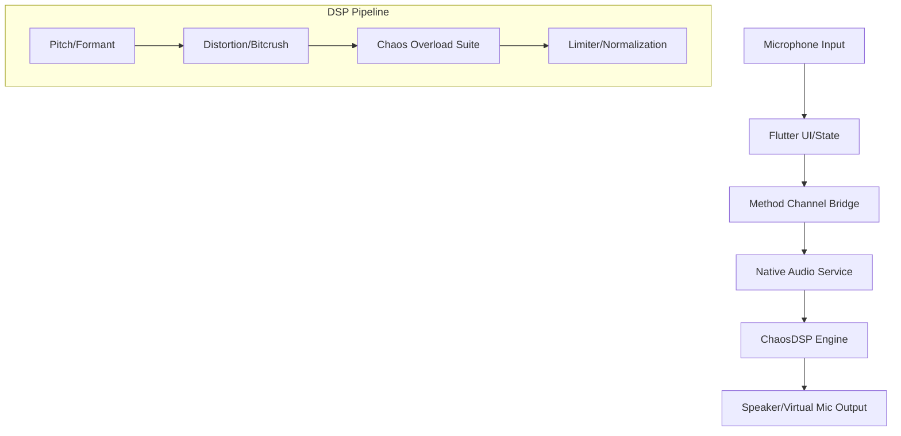

# ☠️ ChaosVoice

```
  ██████╗██╗  ██╗ █████╗  ██████╗ ███████╗    ██╗   ██╗ ██████╗ ██╗ ██████╗███████╗
 ██╔════╝██║  ██║██╔══██╗██╔═══██╗██╔════╝    ██║   ██║██╔═══██╗██║██╔════╝██╔════╝
 ██║     ███████║███████║██║   ██║███████╗    ██║   ██║██║   ██║██║██║     █████╗
 ██║     ██╔══██║██╔══██║██║   ██║╚════██║    ╚██╗ ██╔╝██║   ██║██║██║     ██╔══╝
 ╚██████╗██║  ██║██║  ██║╚██████╔╝███████║     ╚████╔╝ ╚██████╔╝██║╚██████╗███████╗
  ╚═════╝╚═╝  ╚═╝╚═╝  ╚═╝ ╚═════╝ ╚══════╝      ╚═══╝   ╚═════╝ ╚═╝ ╚═════╝╚══════╝
```

[](https://github.com/vincenzo-afk/chaos-vpn/actions/workflows/ci.yml)
[](https://flutter.dev)
[](https://developer.android.com)
[](https://developer.apple.com)
[](LICENSE)
[]()

---

## 📖 What is ChaosVoice?

**ChaosVoice** is an extreme real-time, system-wide voice distortion engine for Android and iOS. Built with a high-performance native DSP pipeline, it intercepts your microphone at the OS level and applies a brutal 18-layer processing chain to turn your speech into a demonic, glitched, and scrambled mess.

Designed specifically to cut through noise suppression in apps like **Discord, WhatsApp, and mobile games**, ChaosVoice ensures your voice remains completely unrecognizable to any listener.

---

## 🌪️ The Chaos Suite

ChaosVoice features a hybrid DSP pipeline including the **Chaos Overload** v1.1 suite:

| Effect | Destruction Type | Description |
| :--- | :--- | :--- |
| **Bit Scrambler** | Digital | Raw 16-bit PCM bit corruption. Pure digital garbage noise. |
| **Vocoder Scream** | Robotic | Saturated ring modulation with an LFO-swept carrier wave. |
| **Reverse Glitch** | Temporal | Randomly plays voice fragments in reverse at high frequency. |
| **Stutter Freezer** | Temporal | Simulates a broken-record sample lock by repeating a single frame. |
| **Telephone Overload** | Analog | Resonant bandpass filtering with aggressive signal overdrive. |
| **Pitch Wobble** | Frequency | Non-linear pitch shifting and frequency modulation. |
| **Formant Shifter** | Spectral | Changes vocal tract characteristics without affecting pitch. |
| **Bitcrush & Fuzz** | Distortion | Sample-rate reduction and harsh harmonic saturation. |

---

## ✨ Features

- ✅ **System-Wide Coverage** — Works across Discord, WhatsApp, Phone calls, Free Fire, PUBG, and more.
- ✅ **One-Toggle Control** — Activate/Deactivate instantly via persistent foreground notification.
- ✅ **Resilient Background Service** — Survives app minimize, screen off, and aggressive OS task-killing.
- ✅ **Android Virtual Mic Routing** — Processed audio injected as a VirtualMic source via MediaProjection.
- ✅ **iOS AVAudioEngine Chain** — Low-latency integration for VoIP and communication apps.
- ✅ **Zero-Latency Design** — Optimized native Kotlin/Swift pipeline for real-time interaction.
- ✅ **Presets & Customization** — One-tap presets (Total Corruption, Demon Radio) plus manual sliders.

---

## 🏗️ Architecture

ChaosVoice uses a dual-layer architecture to balance UI flexibility with native performance.



---

## 🚀 Getting Started

### Prerequisites

- **Flutter SDK**: `^3.24.0`
- **Android**: SDK 26+ (Android 8.0+)
- **iOS**: iOS 15.0+

### Installation

1. **Clone the repository:**
   ```bash
   git clone https://github.com/vincenzo-afk/chaos-vpn.git
   cd chaos-vpn
   ```

2. **Install dependencies:**
   ```bash
   flutter pub get
   ```

3. **Run the app:**
   ```bash
   flutter run --release
   ```

## 🛠️ Usage Guide

1. **Grant Permissions**: Enable Microphone, Notifications, and MediaProjection (Screen Recording) when prompted.
2. **Select Intensity**: Choose a preset like **EXTREME** or **TOTAL CORRUPTION** in the Effects tab.
3. **Start the Engine**: Tap the **Start** button. Ensure the notification "☠️ ChaosVoice is ACTIVE" appears.
4. **Speakerphone Mode**: Join your call/game and enable **Speakerphone**. The app uses a mic-to-speaker loopback to feed the processed audio into the remote app.
5. **Optimize**: For best results, disable "Echo Cancellation" or "Noise Suppression" in the target app (e.g., Discord settings).

---

## 🧪 Testing

The project includes a comprehensive DSP pipeline test suite.

```bash
flutter test test/dsp_pipeline_test.dart
```

## 🤝 Contributing

We welcome contributions! Please see our [CONTRIBUTING.md](CONTRIBUTING.md) for details on our code of conduct and the process for submitting pull requests.

## 🛡️ Security

If you discover a security vulnerability, please refer to our [SECURITY.md](SECURITY.md) for reporting instructions.

## 📜 License

This project is licensed under the MIT License - see the [LICENSE](LICENSE) file for details.

---

*Sound like a demon speaking through a broken radio — system-wide, real-time, unstoppable.*
