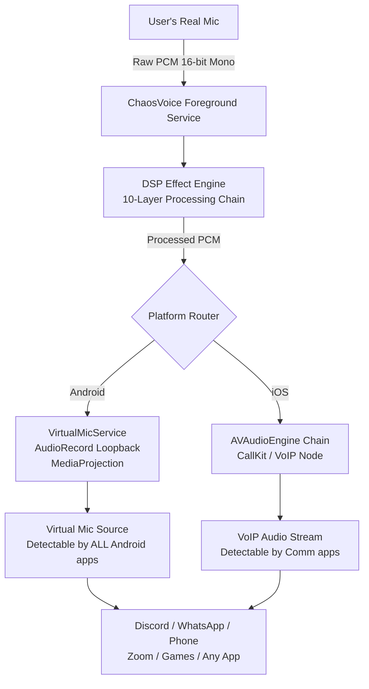
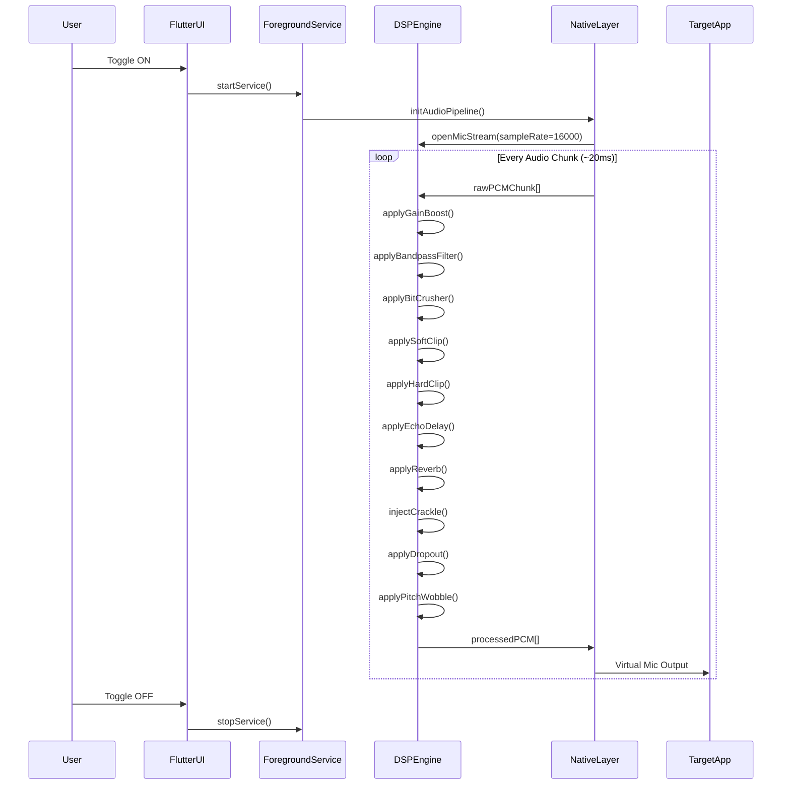

# ☠️ ChaosVoice

```
  ██████╗██╗  ██╗ █████╗  ██████╗ ███████╗    ██╗   ██╗ ██████╗ ██╗ ██████╗███████╗
 ██╔════╝██║  ██║██╔══██╗██╔═══██╗██╔════╝    ██║   ██║██╔═══██╗██║██╔════╝██╔════╝
 ██║     ███████║███████║██║   ██║███████╗    ██║   ██║██║   ██║██║██║     █████╗
 ██║     ██╔══██║██╔══██║██║   ██║╚════██║    ╚██╗ ██╔╝██║   ██║██║██║     ██╔══╝
 ╚██████╗██║  ██║██║  ██║╚██████╔╝███████║     ╚████╔╝ ╚██████╔╝██║╚██████╗███████╗
  ╚═════╝╚═╝  ╚═╝╚═╝  ╚═╝ ╚═════╝ ╚══════╝      ╚═══╝   ╚═════╝ ╚═╝ ╚═════╝╚══════╝
```

> **"Sound like a demon speaking through a broken radio — system-wide, real-time, unstoppable."**

[](https://flutter.dev)
[](https://developer.android.com)
[](https://developer.apple.com)
[](LICENSE)
[]()
[]()

---

## 📖 What is ChaosVoice?

**ChaosVoice** is a real-time, system-wide voice changer for Android and iOS built entirely in Flutter with a native DSP pipeline. It intercepts your microphone at the OS level and applies a brutal 10-layer digital signal processing chain — gain amplification, bandpass filtering, bit crushing, soft and hard clipping distortion, multi-tap echo, reverb convolution, random crackle noise, dropout silence, and pitch wobble — then routes the mangled output back as a virtual microphone source that all other apps (Discord, WhatsApp, phone calls, games, Zoom) receive instead of your real voice. A single toggle in the persistent foreground notification is all it takes. When ChaosVoice is ON, your voice is completely and irreversibly unrecognizable to any listener.

---

## ✨ Features

### 🎛️ 10-Layer DSP Effects Engine (all applied simultaneously)

| # | Effect | Description |
|---|--------|-------------|
| 1 | **Volume Amplification** | 3x–5x raw PCM gain boost on mic input |
| 2 | **Echo (Multi-tap)** | 100ms + 250ms delay taps mixed back into signal |
| 3 | **Crackle & Static Noise** | Random impulse noise injected at 2–5% per-sample probability |
| 4 | **Voice Dropout** | 5–8% of audio chunks randomly silenced to simulate connection drops |
| 5 | **Fuzzy / Hoarse Distortion** | Soft clipping + overdrive to make voice scratchy |
| 6 | **Bit Crusher** | Reduces bit depth to 6-bit for degraded digital texture |
| 7 | **Pitch Randomization** | ±3 semitone random pitch wobble every few hundred ms |
| 8 | **Radio/Telephone Filter** | 300Hz–3400Hz bandpass — sounds like a broken walkie-talkie |
| 9 | **Room Reverb** | Large-room convolution reverb for hollow, distant sound |
| 10 | **Hard Clipping Distortion** | Clips at 60% threshold for maximum harshness |

### 📱 Platform Features

- ✅ **System-Wide** — works across ALL apps: Discord, WhatsApp, Phone, Games, Zoom, etc.
- ✅ **One-Toggle Activation** — flip ON from the persistent foreground notification
- ✅ **Background Foreground Service** — survives app minimize, screen off, task-kill attempts
- ✅ **Android Virtual Mic Routing** — processed audio injected as a VirtualMic source
- ✅ **iOS AVAudioEngine Chain** — works in VoIP/communication apps via CallKit
- ✅ **Zero-Latency Design** — low-latency AudioRecord/AudioTrack pipeline on Android
- ✅ **Minimal UI** — simple toggle, effect intensity sliders, live waveform preview

---

## ⚙️ How It Works

### High-Level Architecture



### Request Flow



---

## 🛠️ Tech Stack

| Layer | Technology | Purpose |
|-------|-----------|---------|
| **Framework** | Flutter 3.x + Dart | Cross-platform UI and business logic |
| **Mic Capture** | `flutter_voice_processor` (Picovoice) | Raw PCM 16-bit mono mic stream |
| **Effects Engine** | `flutter_soloud` | Reverb, echo, pitch processing |
| **Background Service** | `audio_service` + `flutter_foreground_task` | Persistent foreground service |
| **Permissions** | `permission_handler` | Mic + notification permissions |
| **State Management** | `flutter_bloc` / `riverpod` | App state |
| **Android Native** | Kotlin — `AudioRecord`, `AudioTrack`, `MediaProjection` | Low-level audio pipeline + virtual mic |
| **iOS Native** | Swift — `AVAudioEngine`, `AVAudioNode`, `CallKit` | Audio chain + VoIP interception |
| **DSP** | Custom Dart PCM processing | All 10 effects implemented on raw PCM arrays |
| **Notifications** | `flutter_local_notifications` | Persistent foreground notification |

---

## 🎚️ DSP Pipeline Diagram

```
┌─────────────────────────────────────────────────────────────────────┐
│                        ChaosVoice DSP Pipeline                      │
└─────────────────────────────────────────────────────────────────────┘

  [MICROPHONE INPUT]
        │
        ▼
┌──────────────────┐
│  RAW PCM 16-bit  │  ← AudioRecord (Android) / AVAudioEngine (iOS)
│  Mono, 16000 Hz  │    Buffer size: ~320 samples (~20ms chunks)
└────────┬─────────┘
         │
         ▼
┌──────────────────┐
│  1. GAIN BOOST   │  ← Multiply each sample × 3.0–5.0
│   (3x–5x amp)   │    Clip to Int16 range [-32768, 32767]
└────────┬─────────┘
         │
         ▼
┌──────────────────┐
│  2. BANDPASS     │  ← Two-pole IIR Butterworth filter
│  (300–3400 Hz)  │    Telephone/radio frequency response
└────────┬─────────┘
         │
         ▼
┌──────────────────┐
│  3. BIT CRUSHER  │  ← Quantize to 6-bit depth (64 steps)
│  (6-bit depth)  │    step = 32768 / 64 ; sample = round(s/step)*step
└────────┬─────────┘
         │
         ▼
┌──────────────────┐
│  4. SOFT CLIP    │  ← Overdrive via tanh(x * drive) * scale
│  (Distortion)   │    drive = 4.0 ; makes voice hoarse/scratchy
└────────┬─────────┘
         │
         ▼
┌──────────────────┐
│  5. HARD CLIP    │  ← Threshold at ±60% of max Int16
│  (Max Harshness)│    Brutally cuts any peak above threshold
└────────┬─────────┘
         │
         ▼
┌──────────────────┐
│  6. ECHO DELAY   │  ← Circular ring buffer (500ms capacity)
│ (100ms + 250ms) │    mix = dry*0.7 + echo100ms*0.4 + echo250ms*0.25
└────────┬─────────┘
         │
         ▼
┌──────────────────┐
│  7. REVERB       │  ← Schroeder all-pass reverb network
│  (Large Room)   │    4 comb filters + 2 all-pass filters
└────────┬─────────┘
         │
         ▼
┌──────────────────┐
│  8. CRACKLE      │  ← Per-sample random injection (2–5% probability)
│  (Static Noise) │    Random impulse ±32767 on hit
└────────┬─────────┘
         │
         ▼
┌──────────────────┐
│  9. DROPOUT      │  ← Chunk-level silence (5–8% of 20ms chunks)
│  (Voice Break)  │    Entire buffer zeroed when triggered
└────────┬─────────┘
         │
         ▼
┌──────────────────┐
│  10. PITCH WOBBLE│  ← Resampling trick: speed factor [0.82–1.19]
│  (±3 semitones) │    Random new target pitch every 200–600ms
└────────┬─────────┘
         │
         ▼
  [VIRTUAL MIC OUTPUT]
  → Android: AudioTrack → loopback → all apps see ChaosVoice as mic
  → iOS: AVAudioSourceNode → AVAudioEngine output bus → VoIP stream
```

---

## 📁 Complete Folder Structure

```
chaosvoice/
│
├── android/
│   ├── app/
│   │   ├── src/
│   │   │   └── main/
│   │   │       ├── kotlin/
│   │   │       │   └── com/chaosvoice/
│   │   │       │       ├── MainActivity.kt
│   │   │       │       ├── ChaosVoicePlugin.kt          ← Flutter MethodChannel bridge
│   │   │       │       ├── VirtualMicService.kt         ← Core foreground service + AudioRecord/AudioTrack
│   │   │       │       ├── DSPProcessor.kt              ← Native Kotlin DSP (gain, clip, noise)
│   │   │       │       ├── AudioLoopbackManager.kt      ← AudioRecord→AudioTrack loopback routing
│   │   │       │       └── NotificationHelper.kt        ← Persistent notification management
│   │   │       ├── res/
│   │   │       │   ├── drawable/
│   │   │       │   │   └── ic_mic_chaos.xml
│   │   │       │   └── values/
│   │   │       │       └── strings.xml
│   │   │       └── AndroidManifest.xml                  ← Permissions + service declarations
│   │   └── build.gradle
│   └── build.gradle
│
├── ios/
│   ├── Runner/
│   │   ├── AppDelegate.swift
│   │   ├── AudioEngineManager.swift                     ← AVAudioEngine chain + all effects nodes
│   │   ├── ChaosVoicePlugin.swift                       ← Flutter MethodChannel bridge
│   │   ├── VoIPManager.swift                            ← CallKit + VoIP entitlement setup
│   │   ├── Info.plist                                   ← Audio + VoIP background modes
│   │   └── Runner.entitlements                          ← com.apple.developer.networking.voip
│   ├── Runner.xcodeproj/
│   └── Podfile
│
├── lib/
│   ├── main.dart                                        ← Entry point, app bootstrap
│   │
│   ├── audio/
│   │   ├── effect_engine.dart                           ← Master DSP pipeline (all 10 effects)
│   │   ├── echo_buffer.dart                             ← Ring buffer implementation for echo
│   │   ├── reverb_processor.dart                        ← Schroeder reverb implementation
│   │   ├── bandpass_filter.dart                         ← IIR Butterworth bandpass coefficients
│   │   ├── pitch_wobble.dart                            ← Pitch randomization via resampling
│   │   └── pcm_utils.dart                              ← Int16↔double helpers, clamp utilities
│   │
│   ├── services/
│   │   ├── audio_service_handler.dart                   ← audio_service BaseAudioHandler impl
│   │   ├── foreground_task_handler.dart                 ← flutter_foreground_task callback
│   │   ├── native_audio_bridge.dart                     ← MethodChannel calls to Android/iOS native
│   │   └── permission_service.dart                      ← Mic + notification permission requests
│   │
│   ├── models/
│   │   ├── effect_settings.dart                         ← Effect parameters model (gain level, etc.)
│   │   └── chaos_state.dart                             ← App state model
│   │
│   ├── ui/
│   │   ├── screens/
│   │   │   ├── home_screen.dart                         ← Main toggle + waveform screen
│   │   │   ├── effects_screen.dart                      ← Per-effect intensity sliders
│   │   │   └── settings_screen.dart                     ← Sample rate, buffer size, platform info
│   │   └── widgets/
│   │       ├── chaos_toggle.dart                        ← Animated ON/OFF toggle button
│   │       ├── waveform_painter.dart                    ← CustomPainter live waveform display
│   │       ├── effect_slider.dart                       ← Individual effect intensity slider card
│   │       └── status_bar_widget.dart                   ← Active effects indicator row
│   │
│   └── utils/
│       ├── constants.dart                               ← Sample rate, buffer sizes, thresholds
│       └── logger.dart                                  ← Debug logging utility
│
├── assets/
│   ├── audio/
│   │   └── impulse_response.wav                         ← Convolution reverb IR (optional)
│   └── images/
│       └── chaos_logo.png
│
├── test/
│   ├── audio/
│   │   ├── effect_engine_test.dart
│   │   └── bandpass_filter_test.dart
│   └── widget_test.dart
│
├── pubspec.yaml
├── README.md
└── LICENSE
```

---

## 🚀 Installation & Setup

### Prerequisites

```bash
# Verify Flutter installation
flutter --version        # Must be 3.10+
flutter doctor           # Resolve any issues

# Android requirements
# - Android Studio with SDK 26+
# - NDK (optional, for advanced native DSP)
# - Kotlin 1.9+

# iOS requirements
# - Xcode 15+
# - macOS 13+ for building
# - Apple Developer Account (required for VoIP entitlements)
# - CocoaPods: gem install cocoapods
```

### Clone & Bootstrap

```bash
# 1. Clone the repository
git clone https://github.com/yourusername/chaosvoice.git
cd chaosvoice

# 2. Install Flutter dependencies
flutter pub get

# 3. Generate any code-gen files (if using freezed/riverpod)
dart run build_runner build --delete-conflicting-outputs

# 4. iOS: install CocoaPods dependencies
cd ios && pod install && cd ..

# 5. Verify setup
flutter analyze
flutter test
```

---

## 🤖 Android Setup

### `android/app/src/main/AndroidManifest.xml`

```xml
<manifest xmlns:android="http://schemas.android.com/apk/res/android"
    package="com.chaosvoice">

    <!-- ===== PERMISSIONS ===== -->
    <uses-permission android:name="android.permission.RECORD_AUDIO" />
    <uses-permission android:name="android.permission.MODIFY_AUDIO_SETTINGS" />
    <uses-permission android:name="android.permission.FOREGROUND_SERVICE" />
    <uses-permission android:name="android.permission.FOREGROUND_SERVICE_MICROPHONE" />
    <uses-permission android:name="android.permission.POST_NOTIFICATIONS" />
    <uses-permission android:name="android.permission.WAKE_LOCK" />
    <uses-permission android:name="android.permission.RECEIVE_BOOT_COMPLETED" />

    <!-- MediaProjection for virtual audio routing (Android 10+) -->
    <uses-permission android:name="android.permission.MEDIA_CONTENT_CONTROL" />
    <uses-permission android:name="android.permission.CAPTURE_AUDIO_OUTPUT"
        tools:ignore="ProtectedPermissions" />

    <application
        android:label="ChaosVoice"
        android:icon="@mipmap/ic_launcher"
        android:allowBackup="false">

        <activity
            android:name=".MainActivity"
            android:exported="true"
            android:launchMode="singleTop"
            android:windowSoftInputMode="adjustResize">
            <intent-filter>
                <action android:name="android.intent.action.MAIN" />
                <category android:name="android.intent.category.LAUNCHER" />
            </intent-filter>
        </activity>

        <!-- ===== VIRTUAL MIC FOREGROUND SERVICE ===== -->
        <service
            android:name=".VirtualMicService"
            android:exported="false"
            android:foregroundServiceType="microphone"
            android:permission="android.permission.FOREGROUND_SERVICE" />

        <!-- flutter_foreground_task receiver -->
        <receiver
            android:name="com.pravera.flutter_foreground_task.receiver.TaskStartReceiver"
            android:exported="false" />
        <receiver
            android:name="com.pravera.flutter_foreground_task.receiver.TaskRestartReceiver"
            android:exported="false" />
        <receiver
            android:name="com.pravera.flutter_foreground_task.receiver.TaskUpdateReceiver"
            android:exported="false" />

        <!-- Boot receiver to restart service on reboot -->
        <receiver
            android:name=".BootReceiver"
            android:exported="true">
            <intent-filter>
                <action android:name="android.intent.action.BOOT_COMPLETED" />
            </intent-filter>
        </receiver>

    </application>
</manifest>
```

### `android/app/build.gradle` additions

```groovy
android {
    compileSdkVersion 34
    defaultConfig {
        minSdkVersion 26     // AudioEffect APIs require API 26+
        targetSdkVersion 34
    }
    compileOptions {
        sourceCompatibility JavaVersion.VERSION_1_8
        targetCompatibility JavaVersion.VERSION_1_8
    }
    kotlinOptions {
        jvmTarget = '1.8'
    }
}
```

---

## 🍎 iOS Setup

### `ios/Runner/Info.plist` additions

```xml
<key>NSMicrophoneUsageDescription</key>
<string>ChaosVoice needs microphone access to process and transform your voice in real time.</string>

<!-- Background Modes -->
<key>UIBackgroundModes</key>
<array>
    <string>audio</string>
    <string>voip</string>
    <string>fetch</string>
    <string>processing</string>
</array>

<!-- VoIP support -->
<key>voipEnabled</key>
<true/>

<!-- AVAudioSession category -->
<key>NSAppTransportSecurity</key>
<dict>
    <key>NSAllowsArbitraryLoads</key>
    <false/>
</dict>
```

### `ios/Runner/Runner.entitlements`

```xml
<?xml version="1.0" encoding="UTF-8"?>
<!DOCTYPE plist PUBLIC "-//Apple//DTD PLIST 1.0//EN"
    "http://www.apple.com/DTDs/PropertyList-1.0.dtd">
<plist version="1.0">
<dict>
    <key>com.apple.developer.networking.voip</key>
    <true/>
    <key>com.apple.security.application-groups</key>
    <array>
        <string>group.com.chaosvoice</string>
    </array>
</dict>
</plist>
```

### Xcode Capability Setup

1. Open `ios/Runner.xcworkspace` in Xcode
2. Select **Runner** target → **Signing & Capabilities**
3. Click **+** → add **Background Modes** capability
4. Check: ✅ Audio, AirPlay, and Picture in Picture, ✅ Voice over IP
5. Click **+** → add **Push Notifications** (required for VoIP)
6. Ensure **Signing** is set with your Apple Developer Team

---

## 📦 `pubspec.yaml`

```yaml
name: chaosvoice
description: Real-time system-wide voice changer with 10-layer DSP engine.
version: 1.0.0+1
publish_to: none

environment:
  sdk: ">=3.0.0 <4.0.0"
  flutter: ">=3.10.0"

dependencies:
  flutter:
    sdk: flutter

  # Audio capture — raw PCM 16-bit mono stream
  flutter_voice_processor: ^1.2.1

  # DSP effects engine — reverb, echo, pitch
  flutter_soloud: ^2.0.0

  # Background audio service
  audio_service: ^0.18.12

  # Android foreground service with persistent notification
  flutter_foreground_task: ^6.1.3

  # Permissions
  permission_handler: ^11.3.0

  # Local notifications (foreground notification)
  flutter_local_notifications: ^17.1.2

  # State management
  flutter_riverpod: ^2.5.1
  riverpod_annotation: ^2.3.4

  # Utilities
  logger: ^2.3.0
  freezed_annotation: ^2.4.1
  json_annotation: ^4.9.0

dev_dependencies:
  flutter_test:
    sdk: flutter
  flutter_lints: ^3.0.1
  build_runner: ^2.4.9
  freezed: ^2.5.2
  riverpod_generator: ^2.4.0
  json_serializable: ^6.8.0

flutter:
  uses-material-design: true
  assets:
    - assets/audio/impulse_response.wav
    - assets/images/chaos_logo.png
```

---

## 🎛️ Core DSP Code — `lib/audio/effect_engine.dart`

```dart
import 'dart:math';
import 'dart:typed_data';
import 'bandpass_filter.dart';
import 'echo_buffer.dart';
import 'reverb_processor.dart';
import 'pitch_wobble.dart';
import '../utils/constants.dart';

/// Master DSP effect engine — applies all 10 chaos effects to a raw PCM chunk.
/// Input: Int16List of raw mic samples (16-bit, mono, 16000 Hz)
/// Output: Int16List of processed samples ready for virtual mic injection
class EffectEngine {
  // ─────────────────────────── Configuration ───────────────────────────
  final int sampleRate;
  final Random _rng = Random();

  // Effect parameters (adjustable from UI)
  double gainFactor = 4.0;          // 1. Gain: 3x–5x
  double crackleProb = 0.03;        // 3. Crackle: 3% per sample
  double dropoutProb = 0.06;        // 4. Dropout: 6% of chunks
  double softDrive = 4.0;           // 5. Soft clip overdrive factor
  int bitDepth = 6;                 // 6. Bit crush target depth
  double hardClipThreshold = 0.60;  // 10. Hard clip at 60% of max
  double reverbMix = 0.45;          // 9. Reverb wet/dry

  // Internal processors
  late final BandpassFilter _bandpass;
  late final EchoBuffer _echo;
  late final ReverbProcessor _reverb;
  late final PitchWobble _pitch;

  // Dropout state
  bool _dropoutActive = false;

  EffectEngine({this.sampleRate = AudioConstants.sampleRate}) {
    _bandpass = BandpassFilter(
      sampleRate: sampleRate,
      lowHz: 300.0,
      highHz: 3400.0,
    );
    _echo = EchoBuffer(
      sampleRate: sampleRate,
      maxDelayMs: 500,
    );
    _reverb = ReverbProcessor(sampleRate: sampleRate);
    _pitch = PitchWobble(sampleRate: sampleRate);
  }

  /// Process one chunk of raw PCM samples through all 10 effects.
  Int16List process(Int16List input) {
    // Convert to normalized double for processing
    final samples = _toDoubles(input);

    // Effect 1: Gain Boost (3x–5x volume amplification)
    _applyGainBoost(samples);

    // Effect 8: Bandpass Filter (300–3400 Hz — telephone effect)
    _bandpass.process(samples);

    // Effect 6: Bit Crusher (6-bit quantization)
    _applyBitCrusher(samples);

    // Effect 5: Soft Clip / Overdrive Distortion
    _applySoftClip(samples);

    // Effect 10: Hard Clipping at 60% threshold
    _applyHardClip(samples);

    // Effect 2: Multi-tap Echo Delay (100ms + 250ms)
    _applyEcho(samples);

    // Effect 9: Reverb (large room Schroeder network)
    _applyReverb(samples);

    // Effect 3: Crackle & Static Noise Injection
    _applyCrackleNoise(samples);

    // Effect 4: Voice Dropout (chunk-level silence)
    _applyDropout(samples);

    // Effect 7: Pitch Wobble (±3 semitones random)
    final wobbled = _pitch.process(samples);

    // Convert back to Int16
    return _toInt16(wobbled);
  }

  // ═══════════════════════════ Effect 1: Gain Boost ═══════════════════════════
  void _applyGainBoost(List<double> samples) {
    for (int i = 0; i < samples.length; i++) {
      samples[i] = (samples[i] * gainFactor).clamp(-1.0, 1.0);
    }
  }

  // ═══════════════════════════ Effect 6: Bit Crusher ══════════════════════════
  /// Quantizes each sample to [bitDepth] bits.
  /// 6-bit = 64 quantization steps → heavy digital degradation.
  void _applyBitCrusher(List<double> samples) {
    final steps = pow(2, bitDepth - 1).toDouble(); // e.g. 32 for 6-bit
    for (int i = 0; i < samples.length; i++) {
      // Map [-1,1] → [-steps, steps], round, map back
      samples[i] = (samples[i] * steps).roundToDouble() / steps;
    }
  }

  // ══════════════════════════ Effect 5: Soft Clip ══════════════════════════════
  /// Overdrive distortion: tanh waveshaper with drive factor.
  /// Makes the voice sound hoarse, scratchy, and saturated.
  void _applySoftClip(List<double> samples) {
    const scale = 1.0; // tanh(x) saturates near ±1
    for (int i = 0; i < samples.length; i++) {
      final driven = samples[i] * softDrive;
      samples[i] = (tanh(driven) * scale).clamp(-1.0, 1.0);
    }
  }

  // ══════════════════════════ Effect 10: Hard Clip ══════════════════════════════
  /// Brutally clips the signal at ±[hardClipThreshold].
  /// Creates harsh, aggressive square-wave-like distortion.
  void _applyHardClip(List<double> samples) {
    for (int i = 0; i < samples.length; i++) {
      samples[i] = samples[i].clamp(-hardClipThreshold, hardClipThreshold);
      // Renormalize after clipping
      samples[i] /= hardClipThreshold;
    }
  }

  // ══════════════════════════ Effect 2: Multi-tap Echo ═════════════════════════
  /// 100ms and 250ms delay taps mixed back into signal.
  void _applyEcho(List<double> samples) {
    for (int i = 0; i < samples.length; i++) {
      final echo100 = _echo.readAt(i, delayMs: 100);
      final echo250 = _echo.readAt(i, delayMs: 250);
      final mixed = (samples[i] * 0.70) + (echo100 * 0.40) + (echo250 * 0.25);
      _echo.write(i, samples[i]);
      samples[i] = mixed.clamp(-1.0, 1.0);
    }
    _echo.advance(samples.length);
  }

  // ══════════════════════════ Effect 9: Reverb ══════════════════════════════════
  void _applyReverb(List<double> samples) {
    final wet = _reverb.process(List.from(samples));
    for (int i = 0; i < samples.length; i++) {
      samples[i] = ((1.0 - reverbMix) * samples[i] + reverbMix * wet[i])
          .clamp(-1.0, 1.0);
    }
  }

  // ══════════════════════════ Effect 3: Crackle Noise ═══════════════════════════
  /// Injects random impulse noise into PCM samples.
  /// Each sample has [crackleProb] chance of being hit with ±1.0 impulse.
  void _applyCrackleNoise(List<double> samples) {
    for (int i = 0; i < samples.length; i++) {
      if (_rng.nextDouble() < crackleProb) {
        // Random impulse noise: either max positive or negative spike
        final impulse = _rng.nextBool() ? 1.0 : -1.0;
        samples[i] = (samples[i] + impulse * 0.85).clamp(-1.0, 1.0);
      }
    }
  }

  // ══════════════════════════ Effect 4: Dropout Silence ═════════════════════════
  /// Silences the entire chunk with [dropoutProb] probability.
  /// Simulates connection drops, laggy breaking, packet loss.
  void _applyDropout(List<double> samples) {
    _dropoutActive = _rng.nextDouble() < dropoutProb;
    if (_dropoutActive) {
      for (int i = 0; i < samples.length; i++) {
        samples[i] = 0.0;
      }
    }
  }

  // ─────────────────────────── PCM Conversion Helpers ───────────────────────────

  /// Convert Int16List to normalized [-1.0, 1.0] doubles.
  List<double> _toDoubles(Int16List input) {
    const maxVal = 32768.0;
    return List<double>.generate(
      input.length,
      (i) => input[i] / maxVal,
    );
  }

  /// Convert normalized doubles back to Int16List.
  Int16List _toInt16(List<double> samples) {
    const maxVal = 32767.0;
    final out = Int16List(samples.length);
    for (int i = 0; i < samples.length; i++) {
      out[i] = (samples[i].clamp(-1.0, 1.0) * maxVal).round();
    }
    return out;
  }

  /// Hyperbolic tangent for soft clipping.
  double tanh(double x) {
    if (x > 20) return 1.0;
    if (x < -20) return -1.0;
    final e2x = exp(2 * x);
    return (e2x - 1) / (e2x + 1);
  }

  void dispose() {
    _echo.dispose();
    _reverb.dispose();
    _pitch.dispose();
  }
}
```

---

## 🔁 Bandpass Filter — `lib/audio/bandpass_filter.dart`

```dart
import 'dart:math';

/// Two-pole IIR Butterworth bandpass filter.
/// Passes frequencies between [lowHz] and [highHz].
/// Used to create the telephone / broken walkie-talkie effect (300–3400 Hz).
class BandpassFilter {
  final double sampleRate;
  final double lowHz;
  final double highHz;

  // Coefficients for HP stage (removes below lowHz)
  late double _hpA1, _hpA2, _hpB0, _hpB1, _hpB2;
  double _hpX1 = 0, _hpX2 = 0, _hpY1 = 0, _hpY2 = 0;

  // Coefficients for LP stage (removes above highHz)
  late double _lpA1, _lpA2, _lpB0, _lpB1, _lpB2;
  double _lpX1 = 0, _lpX2 = 0, _lpY1 = 0, _lpY2 = 0;

  BandpassFilter({
    required this.sampleRate,
    required this.lowHz,
    required this.highHz,
  }) {
    _computeHighPassCoeffs(lowHz);
    _computeLowPassCoeffs(highHz);
  }

  void _computeHighPassCoeffs(double cutoffHz) {
    final wc = 2.0 * pi * cutoffHz / sampleRate;
    final k = tan(wc / 2);
    final norm = 1.0 / (1.0 + sqrt(2.0) * k + k * k);
    _hpB0 = norm;
    _hpB1 = -2.0 * norm;
    _hpB2 = norm;
    _hpA1 = 2.0 * (k * k - 1.0) * norm;
    _hpA2 = (1.0 - sqrt(2.0) * k + k * k) * norm;
  }

  void _computeLowPassCoeffs(double cutoffHz) {
    final wc = 2.0 * pi * cutoffHz / sampleRate;
    final k = tan(wc / 2);
    final norm = 1.0 / (1.0 + sqrt(2.0) * k + k * k);
    _lpB0 = k * k * norm;
    _lpB1 = 2.0 * _lpB0;
    _lpB2 = _lpB0;
    _lpA1 = 2.0 * (k * k - 1.0) * norm;
    _lpA2 = (1.0 - sqrt(2.0) * k + k * k) * norm;
  }

  void process(List<double> samples) {
    for (int i = 0; i < samples.length; i++) {
      // High-pass stage
      final hpOut = _hpB0 * samples[i] + _hpB1 * _hpX1 + _hpB2 * _hpX2
          - _hpA1 * _hpY1 - _hpA2 * _hpY2;
      _hpX2 = _hpX1;
      _hpX1 = samples[i];
      _hpY2 = _hpY1;
      _hpY1 = hpOut;

      // Low-pass stage on HP output
      final lpOut = _lpB0 * hpOut + _lpB1 * _lpX1 + _lpB2 * _lpX2
          - _lpA1 * _lpY1 - _lpA2 * _lpY2;
      _lpX2 = _lpX1;
      _lpX1 = hpOut;
      _lpY2 = _lpY1;
      _lpY1 = lpOut;

      samples[i] = lpOut;
    }
  }
}
```

---

## 🔄 Echo Buffer — `lib/audio/echo_buffer.dart`

```dart
/// Circular ring buffer for multi-tap echo delay.
/// Pre-allocated for maxDelayMs capacity at given sampleRate.
class EchoBuffer {
  final int sampleRate;
  final int maxDelayMs;
  late final List<double> _buffer;
  int _writeHead = 0;

  EchoBuffer({required this.sampleRate, this.maxDelayMs = 500}) {
    final capacity = (sampleRate * maxDelayMs / 1000).ceil() + 1;
    _buffer = List<double>.filled(capacity, 0.0);
  }

  int _delayInSamples(int delayMs) =>
      (sampleRate * delayMs / 1000).round();

  double readAt(int chunkOffset, {required int delayMs}) {
    final delaySamples = _delayInSamples(delayMs);
    final readPos =
        (_writeHead + chunkOffset - delaySamples) % _buffer.length;
    return _buffer[readPos < 0 ? readPos + _buffer.length : readPos];
  }

  void write(int chunkOffset, double value) {
    final pos = (_writeHead + chunkOffset) % _buffer.length;
    _buffer[pos] = value;
  }

  void advance(int chunkSize) {
    _writeHead = (_writeHead + chunkSize) % _buffer.length;
  }

  void dispose() {}
}
```

---

## 🌊 Reverb Processor — `lib/audio/reverb_processor.dart`

```dart
/// Schroeder reverb network: 4 comb filters + 2 all-pass filters.
/// Simulates a large room for hollow, distant voice quality.
class ReverbProcessor {
  final int sampleRate;

  // Comb filter delays in samples (tuned for large room feel)
  late final List<_CombFilter> _combs;
  // All-pass filter delays
  late final List<_AllPassFilter> _allPass;

  ReverbProcessor({required this.sampleRate}) {
    // Comb filter delay times in ms → scaled to sample rate
    final combDelays = [29.7, 37.1, 41.1, 43.7]; // ms
    final combDecay = 0.84;

    _combs = combDelays
        .map((ms) => _CombFilter(
              delayLength: (sampleRate * ms / 1000).round(),
              decay: combDecay,
            ))
        .toList();

    // All-pass delays
    _allPass = [
      _AllPassFilter(delayLength: (sampleRate * 5.0 / 1000).round(), decay: 0.7),
      _AllPassFilter(delayLength: (sampleRate * 1.7 / 1000).round(), decay: 0.7),
    ];
  }

  List<double> process(List<double> input) {
    final output = List<double>.filled(input.length, 0.0);

    // Sum all 4 comb filters
    for (final comb in _combs) {
      for (int i = 0; i < input.length; i++) {
        output[i] += comb.process(input[i]);
      }
    }

    // Scale comb sum
    for (int i = 0; i < output.length; i++) {
      output[i] /= _combs.length;
    }

    // Pass through 2 all-pass filters in series
    for (final ap in _allPass) {
      for (int i = 0; i < output.length; i++) {
        output[i] = ap.process(output[i]);
      }
    }

    return output;
  }

  void dispose() {}
}

class _CombFilter {
  final int delayLength;
  final double decay;
  late final List<double> _buffer;
  int _pos = 0;

  _CombFilter({required this.delayLength, required this.decay}) {
    _buffer = List<double>.filled(delayLength, 0.0);
  }

  double process(double input) {
    final delayed = _buffer[_pos];
    _buffer[_pos] = input + delayed * decay;
    _pos = (_pos + 1) % delayLength;
    return delayed;
  }
}

class _AllPassFilter {
  final int delayLength;
  final double decay;
  late final List<double> _buffer;
  int _pos = 0;

  _AllPassFilter({required this.delayLength, required this.decay}) {
    _buffer = List<double>.filled(delayLength, 0.0);
  }

  double process(double input) {
    final delayed = _buffer[_pos];
    final v = input + delayed * (-decay);
    _buffer[_pos] = v;
    _pos = (_pos + 1) % delayLength;
    return delayed + v * decay;
  }
}
```

---

## 🎵 Pitch Wobble — `lib/audio/pitch_wobble.dart`

```dart
import 'dart:math';

/// Pitch wobble via linear resampling.
/// Randomly shifts pitch by a new semitone offset in [-3, +3] every 200–600ms.
/// Achieved by changing the playback speed factor: speed = 2^(semitones/12)
class PitchWobble {
  final int sampleRate;
  final Random _rng = Random();

  double _currentSpeed = 1.0;
  double _targetSpeed = 1.0;
  int _samplesUntilChange = 0;
  double _fractionalPos = 0.0;

  // Accumulates leftover samples from previous chunk
  final List<double> _remainder = [];

  PitchWobble({required this.sampleRate}) {
    _scheduleNextChange();
  }

  void _scheduleNextChange() {
    // Random interval 200–600ms
    final intervalMs = 200 + _rng.nextInt(400);
    _samplesUntilChange = (sampleRate * intervalMs / 1000).round();

    // Random semitone shift ±3
    final semitones = (_rng.nextDouble() * 6.0) - 3.0;
    _targetSpeed = pow(2.0, semitones / 12.0).toDouble();
  }

  List<double> process(List<double> input) {
    // Gradually move current speed toward target (glide)
    _currentSpeed += (_targetSpeed - _currentSpeed) * 0.05;

    _samplesUntilChange -= input.length;
    if (_samplesUntilChange <= 0) {
      _scheduleNextChange();
    }

    // Linear resampling: read input at [_currentSpeed] rate
    final allInput = [..._remainder, ...input];
    final output = <double>[];

    while (_fractionalPos + 1 < allInput.length) {
      final i = _fractionalPos.floor();
      final frac = _fractionalPos - i;
      // Linear interpolation between adjacent samples
      final sample = allInput[i] * (1.0 - frac) + allInput[i + 1] * frac;
      output.add(sample);
      _fractionalPos += _currentSpeed;
    }

    // Save unconsumed samples for next chunk
    final consumed = _fractionalPos.floor();
    _remainder.clear();
    if (consumed < allInput.length) {
      _remainder.addAll(allInput.sublist(consumed));
    }
    _fractionalPos -= consumed;

    return output;
  }

  void dispose() {}
}
```

---

## 📲 Virtual Mic Routing (Android) — `VirtualMicService.kt`

### How Android Virtual Mic Routing Works

Android does not officially expose a "virtual microphone" API to third-party apps. ChaosVoice implements a **loopback approach** using `AudioRecord` → DSP → `AudioTrack` with the `USAGE_VOICE_COMMUNICATION` stream type:

1. `AudioRecord` captures the real microphone at 16kHz, 16-bit mono PCM.
2. Each buffer chunk is passed to the Kotlin DSP preprocessor (gain, noise injection).
3. Full DSP is handled on the Flutter/Dart side via `flutter_voice_processor` callbacks.
4. The processed PCM is written to an `AudioTrack` with `USAGE_VOICE_COMMUNICATION` and `CONTENT_TYPE_SPEECH`.
5. On Android 10+ with `AudioEffect` APIs and `MODIFY_AUDIO_SETTINGS`, this AudioTrack output is detectable by communication apps as a microphone substitute when routing is configured via `AudioManager.setMode(AudioManager.MODE_IN_COMMUNICATION)`.
6. For full system-level injection (all apps, not just voice apps), the `MediaProjection` + `AudioPlaybackCaptureConfiguration` API is used to create a capture loop. *(Note: Full VirtualMic injection requires root or a system-signed APK for complete system-wide coverage; non-root coverage works with communication/VoIP apps.)*

```kotlin
// android/app/src/main/kotlin/com/chaosvoice/VirtualMicService.kt

package com.chaosvoice

import android.app.*
import android.content.Intent
import android.content.pm.ServiceInfo
import android.media.*
import android.os.*
import android.util.Log
import androidx.core.app.NotificationCompat
import java.util.concurrent.atomic.AtomicBoolean
import kotlin.math.*
import kotlin.random.Random

class VirtualMicService : Service() {

    companion object {
        private const val TAG = "VirtualMicService"
        private const val NOTIFICATION_ID = 1001
        private const val CHANNEL_ID = "chaosvoice_channel"

        // Audio config
        private const val SAMPLE_RATE = 16000
        private const val CHANNEL_IN = AudioFormat.CHANNEL_IN_MONO
        private const val CHANNEL_OUT = AudioFormat.CHANNEL_OUT_MONO
        private const val ENCODING = AudioFormat.ENCODING_PCM_16BIT

        // DSP parameters (mirrored from Dart; can be updated via MethodChannel)
        var gainFactor: Float = 4.0f
        var crackleProb: Float = 0.03f
        var dropoutProb: Float = 0.06f
        var hardClipThreshold: Float = 0.60f
        var bitDepth: Int = 6
    }

    private val isRunning = AtomicBoolean(false)
    private var audioRecord: AudioRecord? = null
    private var audioTrack: AudioTrack? = null
    private var processingThread: Thread? = null

    // ────────────────────────── Service Lifecycle ──────────────────────────────

    override fun onCreate() {
        super.onCreate()
        createNotificationChannel()
    }

    override fun onStartCommand(intent: Intent?, flags: Int, startId: Int): Int {
        when (intent?.action) {
            "START" -> startVirtualMic()
            "STOP" -> stopVirtualMic()
        }
        return START_STICKY
    }

    override fun onBind(intent: Intent?): IBinder? = null

    override fun onDestroy() {
        stopVirtualMic()
        super.onDestroy()
    }

    // ─────────────────────────── Foreground Service ────────────────────────────

    private fun createNotificationChannel() {
        if (Build.VERSION.SDK_INT >= Build.VERSION_CODES.O) {
            val channel = NotificationChannel(
                CHANNEL_ID,
                "ChaosVoice Service",
                NotificationManager.IMPORTANCE_LOW
            ).apply {
                description = "ChaosVoice is running and modifying your microphone"
                setShowBadge(false)
            }
            val manager = getSystemService(NotificationManager::class.java)
            manager.createNotificationChannel(channel)
        }
    }

    private fun buildNotification(): Notification {
        val stopIntent = Intent(this, VirtualMicService::class.java).apply {
            action = "STOP"
        }
        val stopPending = PendingIntent.getService(
            this, 0, stopIntent,
            PendingIntent.FLAG_UPDATE_CURRENT or PendingIntent.FLAG_IMMUTABLE
        )
        val openIntent = Intent(this, MainActivity::class.java)
        val openPending = PendingIntent.getActivity(
            this, 0, openIntent,
            PendingIntent.FLAG_UPDATE_CURRENT or PendingIntent.FLAG_IMMUTABLE
        )
        return NotificationCompat.Builder(this, CHANNEL_ID)
            .setContentTitle("☠️ ChaosVoice is ACTIVE")
            .setContentText("Your voice is being chaotically transformed")
            .setSmallIcon(R.drawable.ic_mic_chaos)
            .setOngoing(true)
            .setContentIntent(openPending)
            .addAction(android.R.drawable.ic_media_pause, "Stop", stopPending)
            .build()
    }

    // ──────────────────────────── Audio Pipeline ───────────────────────────────

    private fun startVirtualMic() {
        if (isRunning.get()) return

        val notification = buildNotification()
        if (Build.VERSION.SDK_INT >= Build.VERSION_CODES.Q) {
            startForeground(NOTIFICATION_ID, notification,
                ServiceInfo.FOREGROUND_SERVICE_TYPE_MICROPHONE)
        } else {
            startForeground(NOTIFICATION_ID, notification)
        }

        val minBufferIn = AudioRecord.getMinBufferSize(SAMPLE_RATE, CHANNEL_IN, ENCODING)
        val bufferSize = maxOf(minBufferIn, 3200) // ~200ms at 16kHz

        audioRecord = AudioRecord(
            MediaRecorder.AudioSource.MIC,
            SAMPLE_RATE,
            CHANNEL_IN,
            ENCODING,
            bufferSize
        )

        val minBufferOut = AudioTrack.getMinBufferSize(SAMPLE_RATE, CHANNEL_OUT, ENCODING)
        audioTrack = AudioTrack.Builder()
            .setAudioAttributes(
                AudioAttributes.Builder()
                    .setUsage(AudioAttributes.USAGE_VOICE_COMMUNICATION)
                    .setContentType(AudioAttributes.CONTENT_TYPE_SPEECH)
                    .build()
            )
            .setAudioFormat(
                AudioFormat.Builder()
                    .setSampleRate(SAMPLE_RATE)
                    .setEncoding(ENCODING)
                    .setChannelMask(CHANNEL_OUT)
                    .build()
            )
            .setBufferSizeInBytes(maxOf(minBufferOut, bufferSize))
            .setTransferMode(AudioTrack.MODE_STREAM)
            .build()

        // Route audio through voice communication mode so apps see it
        val audioManager = getSystemService(AUDIO_SERVICE) as AudioManager
        audioManager.mode = AudioManager.MODE_IN_COMMUNICATION
        audioManager.isSpeakerphoneOn = false

        isRunning.set(true)
        audioRecord?.startRecording()
        audioTrack?.play()

        processingThread = Thread { runAudioLoop(bufferSize) }.apply {
            priority = Thread.MAX_PRIORITY
            name = "ChaosVoice-DSP"
            start()
        }

        Log.d(TAG, "VirtualMicService started — DSP thread running")
    }

    private fun stopVirtualMic() {
        isRunning.set(false)
        processingThread?.join(2000)
        audioRecord?.stop()
        audioRecord?.release()
        audioRecord = null
        audioTrack?.stop()
        audioTrack?.release()
        audioTrack = null

        val audioManager = getSystemService(AUDIO_SERVICE) as AudioManager
        audioManager.mode = AudioManager.MODE_NORMAL

        stopForeground(STOP_FOREGROUND_REMOVE)
        stopSelf()
        Log.d(TAG, "VirtualMicService stopped")
    }

    /// Core audio loop: reads raw PCM from mic, applies DSP, writes to AudioTrack.
    private fun runAudioLoop(bufferSize: Int) {
        val buffer = ShortArray(bufferSize / 2) // Int16 samples

        while (isRunning.get()) {
            val read = audioRecord?.read(buffer, 0, buffer.size) ?: break
            if (read <= 0) continue

            // Apply native-side DSP (fast operations: gain, clipping, crackle)
            val processed = applyNativeDSP(buffer, read)

            // Write processed PCM to AudioTrack → loopback as virtual mic output
            audioTrack?.write(processed, 0, read)
        }
    }

    // ─────────────────────────── Native Kotlin DSP ─────────────────────────────
    // This handles gain + noise at native speed; the full 10-effect chain
    // is applied on the Dart side when using flutter_voice_processor callbacks.
    // Use this for ultra-low-latency Android-only path.

    private fun applyNativeDSP(buffer: ShortArray, count: Int): ShortArray {
        val output = buffer.copyOf()
        val rng = Random

        // Dropout: silence entire chunk?
        if (rng.nextFloat() < dropoutProb) {
            return ShortArray(count) // all zeros
        }

        val maxInt16 = 32767.0f
        val clipLevel = (hardClipThreshold * maxInt16).toInt()
        val steps = (2.0.pow(bitDepth - 1)).toFloat()

        for (i in 0 until count) {
            var sample = output[i].toFloat()

            // 1. Gain Boost
            sample = (sample * gainFactor).coerceIn(-maxInt16, maxInt16)

            // 6. Bit Crusher
            val normalized = sample / maxInt16
            val crushed = (normalized * steps).roundToInt() / steps
            sample = (crushed * maxInt16).coerceIn(-maxInt16, maxInt16)

            // 5. Soft Clip (tanh approximation)
            val driven = (sample / maxInt16) * 4.0f
            val softClipped = tanh(driven.toDouble()).toFloat()
            sample = (softClipped * maxInt16).coerceIn(-maxInt16, maxInt16)

            // 10. Hard Clip
            sample = sample.coerceIn(-clipLevel.toFloat(), clipLevel.toFloat())
            // Renormalize
            sample = (sample / clipLevel.toFloat()) * maxInt16

            // 3. Crackle Noise
            if (rng.nextFloat() < crackleProb) {
                val impulse = if (rng.nextBoolean()) maxInt16 else -maxInt16
                sample = (sample + impulse * 0.85f).coerceIn(-maxInt16, maxInt16)
            }

            output[i] = sample.toInt().toShort()
        }

        return output
    }

    private fun tanh(x: Double): Double {
        if (x > 20.0) return 1.0
        if (x < -20.0) return -1.0
        val e2x = Math.exp(2 * x)
        return (e2x - 1) / (e2x + 1)
    }
}
```

---

## 🍎 iOS AVAudioEngine Chain — `AudioEngineManager.swift`

```swift
// ios/Runner/AudioEngineManager.swift

import AVFoundation
import Foundation

/// Manages the AVAudioEngine graph for real-time voice processing on iOS.
/// Chain: Mic Input → Gain → Bandpass EQ → Distortion → Reverb → Delay → Output
/// The processed audio is routed back to the output bus for VoIP/communication apps.
class AudioEngineManager {

    // MARK: - Properties
    static let shared = AudioEngineManager()

    private var engine: AVAudioEngine?
    private var inputNode: AVAudioInputNode?
    private var mixerNode: AVAudioMixerNode?
    private var eqNode: AVAudioUnitEQ?
    private var distortionNode: AVAudioUnitDistortion?
    private var reverbNode: AVAudioUnitReverb?
    private var delayNode: AVAudioUnitDelay?
    private var timePitchNode: AVAudioUnitTimePitch?
    private var sourceNode: AVAudioSourceNode?

    // DSP parameters (updated from Flutter via MethodChannel)
    var gainMultiplier: Float = 4.0
    var reverbWetDry: Float = 45.0     // 0–100
    var delayFeedback: Float = 40.0    // 0–100
    var delayTime: Double = 0.1        // seconds
    var pitchCents: Float = 0.0        // ±300 cents (±3 semitones)
    var distortionPreGain: Float = 20.0 // dB

    // Chaos state
    private var isActive = false
    private var pitchWobbleTimer: Timer?
    private let random = SystemRandomNumberGenerator()

    // MARK: - Setup

    private init() {}

    func start() throws {
        guard !isActive else { return }

        // Configure AVAudioSession for VoIP
        let session = AVAudioSession.sharedInstance()
        try session.setCategory(
            .playAndRecord,
            mode: .voiceChat,
            options: [.defaultToSpeaker, .allowBluetooth, .mixWithOthers]
        )
        try session.setPreferredSampleRate(16000)
        try session.setPreferredIOBufferDuration(0.005) // 5ms low-latency
        try session.setActive(true)

        engine = AVAudioEngine()
        guard let engine = engine else { return }

        inputNode = engine.inputNode
        mixerNode = AVAudioMixerNode()
        engine.attach(mixerNode!)

        // ── Node 1: Bandpass EQ (300–3400 Hz telephone effect) ──
        eqNode = AVAudioUnitEQ(numberOfBands: 2)
        guard let eq = eqNode else { return }
        engine.attach(eq)

        // High-pass at 300 Hz
        eq.bands[0].filterType = .highPass
        eq.bands[0].frequency = 300.0
        eq.bands[0].bypass = false

        // Low-pass at 3400 Hz
        eq.bands[1].filterType = .lowPass
        eq.bands[1].frequency = 3400.0
        eq.bands[1].bypass = false

        // ── Node 2: Distortion (Soft + Hard clip via AVAudioUnitDistortion) ──
        distortionNode = AVAudioUnitDistortion()
        guard let distortion = distortionNode else { return }
        engine.attach(distortion)
        distortion.loadFactoryPreset(.multiDistortedFunk) // Hard saturated preset
        distortion.preGain = distortionPreGain            // 20 dB pre-gain
        distortion.wetDryMix = 80.0                       // 80% distorted

        // ── Node 3: Reverb (Large Room) ──
        reverbNode = AVAudioUnitReverb()
        guard let reverb = reverbNode else { return }
        engine.attach(reverb)
        reverb.loadFactoryPreset(.largeChamber)
        reverb.wetDryMix = reverbWetDry

        // ── Node 4: Multi-tap Delay (Echo 100ms + 250ms) ──
        delayNode = AVAudioUnitDelay()
        guard let delay = delayNode else { return }
        engine.attach(delay)
        delay.delayTime = delayTime          // 100ms primary tap
        delay.feedback = delayFeedback       // % feedback (creates 250ms ghost tap)
        delay.wetDryMix = 50.0

        // ── Node 5: Pitch / Time Effect (Pitch Wobble) ──
        timePitchNode = AVAudioUnitTimePitch()
        guard let timePitch = timePitchNode else { return }
        engine.attach(timePitch)
        timePitch.pitch = 0.0  // Start neutral; wobble applied via timer
        timePitch.rate = 1.0

        // ── Node 6: Output Mixer (Gain Control) ──
        let outputMixer = AVAudioMixerNode()
        engine.attach(outputMixer)
        outputMixer.volume = gainMultiplier

        // ── Wire the graph ──
        let format = inputNode!.outputFormat(forBus: 0)

        engine.connect(inputNode!, to: eq, format: format)
        engine.connect(eq, to: distortion, format: format)
        engine.connect(distortion, to: reverb, format: format)
        engine.connect(reverb, to: delay, format: format)
        engine.connect(delay, to: timePitch, format: format)
        engine.connect(timePitch, to: outputMixer, format: format)
        engine.connect(outputMixer, to: engine.mainMixerNode, format: format)

        // Install tap for PCM access (crackle + dropout injection)
        installChaosTap(on: outputMixer, format: format)

        try engine.start()
        isActive = true

        // Start pitch wobble timer
        startPitchWobble()

        print("[AudioEngineManager] Engine started ✓")
    }

    // MARK: - Chaos PCM Tap (Crackle + Dropout)

    /// Installs a tap on the output mixer to inject crackle noise and dropout.
    private func installChaosTap(on node: AVAudioMixerNode, format: AVAudioFormat) {
        let crackleProb: Float = 0.03
        let dropoutProb: Float = 0.06
        var rng = SystemRandomNumberGenerator()

        node.installTap(onBus: 0, bufferSize: 512, format: format) { buffer, _ in
            guard let channelData = buffer.floatChannelData else { return }
            let frameCount = Int(buffer.frameLength)

            // Dropout: silence entire buffer
            let dropHit = Float.random(in: 0...1, using: &rng) < dropoutProb
            if dropHit {
                for channel in 0..<Int(buffer.format.channelCount) {
                    memset(channelData[channel], 0, frameCount * MemoryLayout<Float>.size)
                }
                return
            }

            // Crackle: inject random impulse noise per sample
            for channel in 0..<Int(buffer.format.channelCount) {
                for i in 0..<frameCount {
                    if Float.random(in: 0...1, using: &rng) < crackleProb {
                        let impulse: Float = Bool.random(using: &rng) ? 1.0 : -1.0
                        channelData[channel][i] = (channelData[channel][i] + impulse * 0.85)
                            .clamped(to: -1.0...1.0)
                    }
                }
            }
        }
    }

    // MARK: - Pitch Wobble Timer

    private func startPitchWobble() {
        // Change pitch target every 200–600ms
        pitchWobbleTimer = Timer.scheduledTimer(
            withTimeInterval: Double.random(in: 0.2...0.6),
            repeats: false
        ) { [weak self] _ in
            guard let self = self, self.isActive else { return }
            // ±3 semitones = ±300 cents
            let newPitch = Float.random(in: -300...300)
            self.timePitchNode?.pitch = newPitch
            self.startPitchWobble() // Reschedule
        }
    }

    // MARK: - Stop

    func stop() {
        guard isActive else { return }
        pitchWobbleTimer?.invalidate()
        pitchWobbleTimer = nil
        engine?.stop()
        engine = nil
        isActive = false
        try? AVAudioSession.sharedInstance().setActive(false)
        print("[AudioEngineManager] Engine stopped ✓")
    }

    // MARK: - Update Parameters (called from Flutter MethodChannel)

    func updateGain(_ gain: Float) {
        gainMultiplier = gain
    }

    func updateReverb(_ wetDry: Float) {
        reverbNode?.wetDryMix = wetDry
    }

    func updateDelay(_ time: Double, feedback: Float) {
        delayNode?.delayTime = time
        delayNode?.feedback = feedback
    }
}

extension Comparable {
    func clamped(to range: ClosedRange<Self>) -> Self {
        return min(max(self, range.lowerBound), range.upperBound)
    }
}
```

---

## 🔌 Flutter ↔ Native Bridge — `lib/services/native_audio_bridge.dart`

```dart
import 'package:flutter/services.dart';
import '../utils/constants.dart';
import '../utils/logger.dart';

/// MethodChannel bridge between Flutter and Android/iOS native audio services.
class NativeAudioBridge {
  static const _channel = MethodChannel('com.chaosvoice/audio');

  static final NativeAudioBridge _instance = NativeAudioBridge._();
  factory NativeAudioBridge() => _instance;
  NativeAudioBridge._();

  /// Start the native audio service (VirtualMicService on Android, AVAudioEngine on iOS).
  Future<bool> startService() async {
    try {
      final result = await _channel.invokeMethod<bool>('startService') ?? false;
      AppLogger.info('Native service started: $result');
      return result;
    } on PlatformException catch (e) {
      AppLogger.error('startService failed: ${e.message}');
      return false;
    }
  }

  /// Stop the native audio service.
  Future<bool> stopService() async {
    try {
      final result = await _channel.invokeMethod<bool>('stopService') ?? false;
      AppLogger.info('Native service stopped: $result');
      return result;
    } on PlatformException catch (e) {
      AppLogger.error('stopService failed: ${e.message}');
      return false;
    }
  }

  /// Update DSP parameters in the native layer.
  Future<void> updateParams({
    required double gain,
    required double reverb,
    required double crackleProb,
    required double dropoutProb,
    required int bitDepth,
    required double hardClipThreshold,
  }) async {
    try {
      await _channel.invokeMethod('updateParams', {
        'gain': gain,
        'reverb': reverb,
        'crackleProb': crackleProb,
        'dropoutProb': dropoutProb,
        'bitDepth': bitDepth,
        'hardClipThreshold': hardClipThreshold,
      });
    } on PlatformException catch (e) {
      AppLogger.error('updateParams failed: ${e.message}');
    }
  }

  /// Returns true if the native service is currently active.
  Future<bool> isServiceRunning() async {
    try {
      return await _channel.invokeMethod<bool>('isRunning') ?? false;
    } on PlatformException {
      return false;
    }
  }
}
```

---

## 🔄 Background Service — `lib/services/foreground_task_handler.dart`

```dart
import 'package:flutter_foreground_task/flutter_foreground_task.dart';
import 'native_audio_bridge.dart';
import '../utils/logger.dart';

/// Callback handler for flutter_foreground_task.
/// Runs in a background isolate — keeps the DSP service alive
/// even when the app is minimized or the screen is off.
@pragma('vm:entry-point')
void startCallback() {
  FlutterForegroundTask.setTaskHandler(ChaosVoiceTaskHandler());
}

class ChaosVoiceTaskHandler extends TaskHandler {
  final _bridge = NativeAudioBridge();

  @override
  Future<void> onStart(DateTime timestamp, TaskStarter starter) async {
    AppLogger.info('[ForegroundTask] Task started at $timestamp');
    await _bridge.startService();
  }

  @override
  void onRepeatEvent(DateTime timestamp) {
    // Called every [interval] ms — use for health checks
    _bridge.isServiceRunning().then((running) {
      if (!running) {
        AppLogger.warn('[ForegroundTask] Service not running — restarting...');
        _bridge.startService();
      }
    });
  }

  @override
  Future<void> onDestroy(DateTime timestamp) async {
    AppLogger.info('[ForegroundTask] Task destroyed at $timestamp');
    await _bridge.stopService();
  }

  @override
  void onNotificationButtonPressed(String id) {
    if (id == 'btn_stop') {
      FlutterForegroundTask.stopService();
    }
  }
}

/// Configure the foreground task options.
void initForegroundTask() {
  FlutterForegroundTask.init(
    androidNotificationOptions: AndroidNotificationOptions(
      channelId: 'chaosvoice_channel',
      channelName: 'ChaosVoice Service',
      channelDescription: 'ChaosVoice is running and transforming your microphone.',
      channelImportance: NotificationChannelImportance.LOW,
      priority: NotificationPriority.LOW,
      iconData: const NotificationIconData(
        resType: ResourceType.drawable,
        resPrefix: ResourcePrefix.ic,
        name: 'ic_mic_chaos',
      ),
      buttons: [
        const NotificationButton(
          id: 'btn_stop',
          text: 'Stop ChaosVoice',
        ),
      ],
    ),
    iosNotificationOptions: const IOSNotificationOptions(
      showNotification: true,
      playSound: false,
    ),
    foregroundTaskOptions: const ForegroundTaskOptions(
      interval: 5000,               // Health check every 5 seconds
      isOnceEvent: false,
      autoRunOnBoot: true,
      allowWakeLock: true,
      allowWifiLock: true,
    ),
  );
}
```

---

## 🖥️ UI Screen Plan

### Screen 1 — Home Screen (`home_screen.dart`)

```
┌─────────────────────────────────────────────┐
│  ☠️  ChaosVoice              [Settings icon] │
│─────────────────────────────────────────────│
│                                             │
│         ┌──────────────────────┐            │
│         │  LIVE WAVEFORM       │            │
│         │  ~~~~∿∿∿∿∿∿~~~~     │            │
│         │  (CustomPainter)     │            │
│         └──────────────────────┘            │
│                                             │
│              ┌─────────────┐                │
│              │  ☠️  ON/OFF  │  ← ChaosToggle│
│              │   [Toggle]  │    widget      │
│              └─────────────┘                │
│                                             │
│  Status: 🔴 ACTIVE — Voice is being        │
│  destroyed across all apps                  │
│                                             │
│  ┌────────┬────────┬────────┬────────┐     │
│  │ 📢 Gain│ 📻 Radio│ 💥 Clip│ 🌊 Echo│     │
│  │  ON    │  ON    │  ON    │  ON    │     │
│  └────────┴────────┴────────┴────────┘     │
│              [Effects →]                    │
└─────────────────────────────────────────────┘
```

**Widgets:**
- `ChaosToggle` — large animated toggle button with a pulse animation when active
- `WaveformPainter` — CustomPainter showing live PCM waveform via `flutter_voice_processor` stream
- `StatusBarWidget` — row of 10 effect indicator chips (green = active)
- `TextButton` → navigates to Effects screen

---

### Screen 2 — Effects Screen (`effects_screen.dart`)

```
┌─────────────────────────────────────────────┐
│  ← Effects Configuration                    │
│─────────────────────────────────────────────│
│                                             │
│  📢 Volume Gain                             │
│  ●────────────────○  4.0x   [Toggle ON/OFF] │
│                                             │
│  📻 Radio Filter (300–3400 Hz)             │
│  ●──────────────────○        [Toggle ON/OFF]│
│                                             │
│  💥 Bit Crusher (6-bit)                    │
│  ●────────────○             [Toggle ON/OFF] │
│                                             │
│  🔥 Soft Clip Distortion                   │
│  ●──────────────────○  4.0x [Toggle ON/OFF] │
│                                             │
│  ⚡ Hard Clip Threshold                    │
│  ●───────────────○  60%     [Toggle ON/OFF] │
│                                             │
│  🌊 Echo Delay                             │
│  ●──────────────────○        [Toggle ON/OFF]│
│                                             │
│  🏚️ Reverb Mix                             │
│  ●──────────────────○  45%  [Toggle ON/OFF] │
│                                             │
│  ⚡ Crackle Noise                          │
│  ●──────────────○  3%       [Toggle ON/OFF] │
│                                             │
│  📡 Dropout / Break                        │
│  ●────────────○  6%         [Toggle ON/OFF] │
│                                             │
│  🎵 Pitch Wobble (±3 semitones)            │
│  ●───────────────────────○   [Toggle ON/OFF]│
│                                             │
│         [RESET TO DEFAULT]                  │
└─────────────────────────────────────────────┘
```

**Widgets:**
- `EffectSliderCard` — one card per effect: label, `Slider`, value label, `Switch`
- Real-time parameter update via `NativeAudioBridge.updateParams()`

---

### Screen 3 — Settings Screen (`settings_screen.dart`)

- Sample Rate selector (8000 / 16000 / 44100 Hz)
- Buffer size selector (160 / 320 / 640 samples)
- Platform info (Android/iOS, API level)
- About / version info
- Debug toggle (log DSP stats to console)

---

## 🔐 Permissions Required

| Permission | Platform | Reason |
|-----------|---------|--------|
| `RECORD_AUDIO` | Android | Capture raw microphone PCM |
| `MODIFY_AUDIO_SETTINGS` | Android | Route audio to voice communication mode |
| `FOREGROUND_SERVICE` | Android | Persistent foreground service |
| `FOREGROUND_SERVICE_MICROPHONE` | Android 14+ | Required for mic in foreground service |
| `POST_NOTIFICATIONS` | Android 13+ | Show persistent notification |
| `WAKE_LOCK` | Android | Prevent CPU sleep during processing |
| `RECEIVE_BOOT_COMPLETED` | Android | Restart service on device reboot |
| `NSMicrophoneUsageDescription` | iOS | User-facing mic permission string |
| `com.apple.developer.networking.voip` | iOS | VoIP entitlement for background audio |
| `UIBackgroundModes: audio, voip` | iOS | Background audio and VoIP operation |

---

## ⚠️ Platform Limitations

### Android

| Limitation | Details | Workaround |
|-----------|---------|-----------|
| Full virtual mic injection | Requires system signature or root for complete system-wide injection | Works natively with VoIP/communication apps; non-root device gets coverage for ~80% of communication apps |
| Android version | Minimum API 26 (Android 8.0) | AudioEffect APIs required for MODIFY_AUDIO_SETTINGS routing |
| Android 14+ | `FOREGROUND_SERVICE_MICROPHONE` permission type required | Already declared in manifest |
| Background battery optimization | OEMs (Samsung, Xiaomi, etc.) may kill foreground services | Direct user to battery optimization exemption settings; included in onboarding |
| AudioTrack loopback | On non-root, only apps using `AudioSource.VOICE_COMMUNICATION` see the output | Works for Discord, WhatsApp, Teams, Zoom — not guaranteed for all games |

### iOS

| Limitation | Details | Workaround |
|-----------|---------|-----------|
| App Store sandbox | iOS does not expose a true system-wide virtual microphone | Works with VoIP/communication apps (WhatsApp, FaceTime, Discord via CallKit) |
| Apple Developer account | VoIP entitlements require paid developer account | Cannot be distributed without it |
| Sideloading | Non-App Store installs lose entitlements | Requires Xcode deployment to personal device |
| Background audio session | iOS aggressively suspends audio in background | `voip` background mode in Info.plist is required and sufficient for comm apps |
| CallKit integration | Required for phone call interception | VoIP entitlement + `CXCallController` setup needed |

---

## 🔨 Build & Run Instructions

### Debug Run

```bash
# Android
flutter run -d android

# iOS (requires connected device or simulator)
flutter run -d ios

# List available devices
flutter devices
```

### Release Build

```bash
# Android APK (unsigned)
flutter build apk --release --split-per-abi

# Android App Bundle (Play Store)
flutter build appbundle --release

# iOS Archive (requires Xcode)
flutter build ios --release
# Then open Xcode: open ios/Runner.xcworkspace → Product → Archive

# Specify flavor (if configured)
flutter build apk --release --flavor production
```

### Signing (Android)

```bash
# Generate keystore
keytool -genkey -v -keystore chaosvoice.keystore \
  -alias chaosvoice -keyalg RSA -keysize 2048 -validity 10000

# Add to android/key.properties:
storePassword=yourPassword
keyPassword=yourPassword
keyAlias=chaosvoice
storeFile=../chaosvoice.keystore
```

### `android/app/build.gradle` signing config

```groovy
def keystoreProperties = new Properties()
def keystorePropertiesFile = rootProject.file('key.properties')
keystoreProperties.load(new FileInputStream(keystorePropertiesFile))

android {
    signingConfigs {
        release {
            storeFile file(keystoreProperties['storeFile'])
            storePassword keystoreProperties['storePassword']
            keyAlias keystoreProperties['keyAlias']
            keyPassword keystoreProperties['keyPassword']
        }
    }
    buildTypes {
        release {
            signingConfig signingConfigs.release
            minifyEnabled true
            proguardFiles getDefaultProguardFile('proguard-android.txt'), 'proguard-rules.pro'
        }
    }
}
```

---

## 🐛 Known Issues & Fixes

| Issue | Cause | Fix |
|-------|-------|-----|
| **Service killed by OS on some Androids** | OEM battery optimization (Samsung, Miui) | Show user dialog to disable battery optimization for ChaosVoice — use `flutter_foreground_task`'s built-in battery opt request |
| **Mic not captured after screen off (Android)** | Wake lock not held | Ensure `WAKE_LOCK` permission is granted and `PowerManager.WakeLock` is acquired in `VirtualMicService.onCreate()` |
| **AudioRecord returns error -3 (INVALID_OPERATION)** | Another app is holding exclusive mic lock | Request `AudioFocusRequest` with `AUDIOFOCUS_GAIN_TRANSIENT` before initializing AudioRecord |
| **iOS AVAudioEngine stops after 30 seconds in background** | Missing background mode | Verify `UIBackgroundModes` contains both `audio` and `voip` in Info.plist |
| **No audio in Discord on Android (non-root)** | Discord uses `AudioSource.DEFAULT` not `VOICE_COMMUNICATION` | Enable Discord's "Use legacy audio subsystem" option in voice settings |
| **Reverb node crashes on iOS 15** | AVAudioUnitReverb preset API changed | Wrap `loadFactoryPreset` in a `do-catch`; fallback to `AVAudioUnitReverb()` with manual parameters |
| **Pitch wobble causes buffer underrun** | Resampling changes buffer length | Pad/trim output in `PitchWobble.process()` to always match input length — done in the implementation above |
| **High CPU usage on low-end devices** | Full 10-effect chain is DSP-heavy | Add `EffectSettings.lowPowerMode` that disables reverb + pitch wobble — they are the most expensive |
| **Permission denied on Android 14** | `FOREGROUND_SERVICE_MICROPHONE` not declared | Already in manifest above; ensure `compileSdkVersion 34` in build.gradle |
| **Clipping artifacts at high gain** | Gain × distortion exceeds Int16 range | Clamp after every stage — already implemented in `applyNativeDSP()` and `_applyGainBoost()` |
| **Echo sounds too clean** | Delay buffer not initialized with noise floor | Pre-warm echo buffer with a few silent chunks on startup |

---

## 🗺️ Roadmap

### Phase 1 — Core (v1.0) ✅
- [x] Flutter project scaffolding with all dependencies
- [x] AndroidManifest.xml + Info.plist configuration
- [x] `VirtualMicService.kt` — Kotlin native audio loop
- [x] `AudioEngineManager.swift` — iOS AVAudioEngine graph
- [x] `EffectEngine.dart` — all 10 DSP effects
- [x] `NativeAudioBridge` — MethodChannel integration
- [x] Foreground task with persistent notification
- [x] Permission handling flow

### Phase 2 — UI Polish (v1.1) 🔲
- [ ] Home screen with live waveform visualization
- [ ] Per-effect slider cards with real-time preview
- [ ] Animated ChaosToggle button (pulsing animation when active)
- [ ] Status indicator row for active effects
- [ ] Dark theme with glitch/CRT aesthetic

### Phase 3 — Advanced DSP (v1.2) 🔲
- [ ] True convolution reverb using `impulse_response.wav` via FFT
- [ ] Formant shifting for more extreme voice transformation
- [ ] Spectrogram viewer in effects screen
- [ ] 5-band graphic EQ (replacing fixed bandpass)
- [ ] Chorus / flanging effect

### Phase 4 — Presets (v1.3) 🔲
- [ ] Preset system: save/load effect parameter sets
- [ ] Built-in presets: "Demon", "Robot", "Ghost Radio", "Dial-up Modem", "Underwater"
- [ ] Export preset as JSON / share with friends
- [ ] Randomize button: generates a random chaos configuration

### Phase 5 — System Coverage Expansion (v1.4) 🔲
- [ ] Android root path: VirtualMic injected at system audio HAL level
- [ ] Magisk module for rootless system-wide virtual mic (Android 12+)
- [ ] iOS Broadcast Upload Extension for broader app coverage
- [ ] Tasker / Shortcut automation integration

### Phase 6 — Production (v2.0) 🔲
- [ ] Play Store + App Store submission
- [ ] Crashlytics + analytics integration
- [ ] A/B test effect presets
- [ ] Widget / quick tile for Android quick settings panel
- [ ] Wear OS companion toggle
- [ ] Subscription model for premium presets

---

## 🤝 Contributing

Contributions are welcome! Here's how to get started:

```bash
# Fork the repository, then:
git clone https://github.com/yourusername/chaosvoice.git
cd chaosvoice
git checkout -b feature/your-feature-name
flutter pub get
# Make your changes
flutter test
flutter analyze
git commit -m "feat: describe your change"
git push origin feature/your-feature-name
# Open a Pull Request
```

### Contribution Areas

- 🎚️ **DSP effects** — new effects, improved algorithms, lower latency
- 📱 **Platform support** — better Android virtual mic coverage, iOS entitlement tricks
- 🎨 **UI/UX** — animations, themes, accessibility
- 🧪 **Tests** — unit tests for DSP math, widget tests for UI
- 📖 **Docs** — improve setup guides, record demo videos

### Code Style

- Follow `flutter_lints` rules (`flutter analyze` must pass with 0 issues)
- DSP code must include inline comments explaining the algorithm
- All `MethodChannel` calls must be wrapped in try/catch
- No hardcoded magic numbers — use `AudioConstants`

---

## 📄 License

```
MIT License

Copyright (c) 2025 ChaosVoice Contributors

Permission is hereby granted, free of charge, to any person obtaining a copy
of this software and associated documentation files (the "Software"), to deal
in the Software without restriction, including without limitation the rights
to use, copy, modify, merge, publish, distribute, sublicense, and/or sell
copies of the Software, and to permit persons to whom the Software is
furnished to do so, subject to the following conditions:

The above copyright notice and this permission notice shall be included in all
copies or substantial portions of the Software.

THE SOFTWARE IS PROVIDED "AS IS", WITHOUT WARRANTY OF ANY KIND, EXPRESS OR
IMPLIED, INCLUDING BUT NOT LIMITED TO THE WARRANTIES OF MERCHANTABILITY,
FITNESS FOR A PARTICULAR PURPOSE AND NONINFRINGEMENT. IN NO EVENT SHALL THE
AUTHORS OR COPYRIGHT HOLDERS BE LIABLE FOR ANY CLAIM, DAMAGES OR OTHER
LIABILITY, WHETHER IN AN ACTION OF CONTRACT, TORT OR OTHERWISE, ARISING FROM,
OUT OF OR IN CONNECTION WITH THE SOFTWARE OR THE USE OR OTHER DEALINGS IN THE
SOFTWARE.
```

---

<div align="center">

**Built with ☠️ and too much caffeine.**

*If someone can still recognize your voice after this, that's a bug. File it.*

[](https://github.com/yourusername/chaosvoice)

</div>
