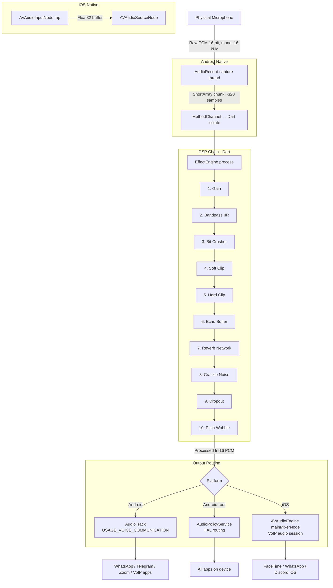

# ChaosVoice

```
  ██████╗██╗  ██╗ █████╗  ██████╗ ███████╗    ██╗   ██╗ ██████╗ ██╗ ██████╗███████╗
 ██╔════╝██║  ██║██╔══██╗██╔═══██╗██╔════╝    ██║   ██║██╔═══██╗██║██╔════╝██╔════╝
 ██║     ███████║███████║██║   ██║███████╗    ██║   ██║██║   ██║██║██║     █████╗
 ██║     ██╔══██║██╔══██║██║   ██║╚════██║    ╚██╗ ██╔╝██║   ██║██║██║     ██╔══╝
 ╚██████╗██║  ██║██║  ██║╚██████╔╝███████║     ╚████╔╝ ╚██████╔╝██║╚██████╗███████╗
  ╚═════╝╚═╝  ╚═╝╚═╝  ╚═╝ ╚═════╝ ╚══════╝      ╚═══╝   ╚═════╝ ╚═╝ ╚═════╝╚══════╝
```

[](https://flutter.dev)
[](https://developer.android.com)
[](https://developer.apple.com)
[](LICENSE)
[]()
[]()

**ChaosVoice** is a real-time voice effects processor for Android and iOS built with Flutter and native audio APIs. It captures raw microphone input, applies a 10-stage DSP processing chain, and routes the output back into the device's audio system so other apps receive the processed voice instead of the original.

> **Honest summary of what this actually does:** On Android (non-root), the processed audio is routed into the voice communication audio stream. Apps that respect `AudioSource.VOICE_COMMUNICATION` — such as WhatsApp, Telegram, and most VoIP apps — will receive the modified voice. On iOS, the effect chain runs inside the app's own audio session. System-wide mic injection is not available on either platform without privileged access. See the [Platform Compatibility](#-platform-compatibility) section for the full breakdown.

---

## Table of Contents

1. [Project Overview](#-project-overview)
2. [Effects Engine](#-effects-engine)
3. [Architecture](#-architecture)
4. [DSP Pipeline](#-dsp-pipeline)
5. [Tech Stack](#-tech-stack)
6. [Folder Structure](#-folder-structure)
7. [Setup & Installation](#-setup--installation)
8. [Android Setup](#-android-setup)
9. [iOS Setup](#-ios-setup)
10. [Permissions](#-permissions)
11. [Platform Compatibility](#-platform-compatibility)
12. [Routing Modes (Android)](#-routing-modes-android)
13. [Core Implementation](#-core-implementation)
14. [Background Service](#-background-service)
15. [UI Overview](#-ui-overview)
16. [Build & Release](#-build--release)
17. [Known Issues & Troubleshooting](#-known-issues--troubleshooting)
18. [What ChaosVoice Can and Cannot Do](#-what-chaosvoice-can-and-cannot-do)
19. [Roadmap](#-roadmap)
20. [Contributing](#-contributing)
21. [License](#-license)

---

## 📖 Project Overview

ChaosVoice processes microphone audio in real time through a multi-stage DSP chain and attempts to route the processed output to other apps. The app runs as a persistent foreground service, meaning it continues working when minimized or when the screen is off.

The core use case is voice transformation during calls, voice chats, and communication sessions. The output voice is heavily distorted — combining multiple layers of gain, filtering, bit reduction, distortion, delay, reverb, noise, and pitch variation — making the original voice unrecognizable.

**Key design decisions:**

- The DSP chain runs entirely in Dart on raw PCM data. No third-party DSP library is required for the core effects.
- Native Kotlin/Swift layers handle audio capture, output routing, and background lifecycle.
- A MethodChannel bridge connects Flutter business logic to native audio services.
- The routing strategy differs by platform and device access level — the app adapts its behavior based on what the OS allows.

---

## 🎛️ Effects Engine

All 10 effects are applied in series to each audio chunk. Each effect can be individually enabled or disabled. Intensity parameters for most effects are adjustable from the UI.

| # | Effect | Algorithm | Default Parameter |
|---|--------|-----------|-------------------|
| 1 | **Gain Boost** | PCM sample multiplication | 4.0× (range: 1×–5×) |
| 2 | **Radio / Telephone Filter** | Two-pole IIR Butterworth bandpass | 300 Hz – 3400 Hz |
| 3 | **Bit Crusher** | Uniform quantization to N bits | 6-bit (64 levels) |
| 4 | **Soft Clip / Overdrive** | `tanh(x × drive)` waveshaper | drive = 4.0 |
| 5 | **Hard Clip** | Threshold clamp + renormalize | 60% of peak |
| 6 | **Echo Delay** | Circular buffer, two taps | 100 ms + 250 ms |
| 7 | **Room Reverb** | Schroeder network (4 comb + 2 all-pass) | 45% wet mix |
| 8 | **Crackle / Static** | Random impulse injection per sample | 3% probability |
| 9 | **Voice Dropout** | Chunk-level silence on probability hit | 6% probability |
| 10 | **Pitch Wobble** | Linear resampling at randomized speed | ±3 semitones, 200–600 ms interval |

**Processing order matters.** Gain runs first to give downstream effects enough signal. Filtering comes before distortion so the bandpass shapes what gets clipped. Reverb and delay run after distortion to smear the already-destroyed signal. Noise injection and dropout happen last so they are not further processed. Pitch wobble is the final stage because it changes the buffer length and must feed directly into output.

---

## ⚙️ Architecture

### Layer Overview

```
┌─────────────────────────────────────────────────────────────┐
│                        Flutter Layer                        │
│  UI Screens  →  State (Riverpod)  →  NativeAudioBridge     │
│               EffectEngine.dart (DSP, pure Dart)            │
└───────────────────────────┬─────────────────────────────────┘
                            │  MethodChannel
          ┌─────────────────┴──────────────────┐
          │                                    │
┌─────────▼──────────┐              ┌──────────▼─────────┐
│   Android (Kotlin)  │              │    iOS (Swift)      │
│                     │              │                     │
│  VirtualMicService  │              │  AudioEngineManager │
│  AudioRecord        │              │  AVAudioEngine      │
│  AudioTrack         │              │  AVAudioInputNode   │
│  AudioManager       │              │  AVAudioUnitEQ      │
│  ForegroundService  │              │  AVAudioUnitReverb  │
│  WakeLock           │              │  AVAudioUnitDelay   │
│                     │              │  AVAudioUnitDistort │
│  [Root path]        │              │  AVAudioSourceNode  │
│  AudioPolicyService │              │  CallKit (VoIP)     │
│  HAL-level routing  │              │                     │
└─────────────────────┘              └─────────────────────┘
```

### Data Flow



### Settings Flow

```
UI Slider (EffectSliderCard)
  → EffectSettings model (Riverpod state)
    → EffectEngine parameter update (in-place, thread-safe)
      → NativeAudioBridge.updateParams() (MethodChannel)
        → VirtualMicService.updateParams() / AudioEngineManager.updateParams()
```

Parameter changes apply to the next audio chunk. There is no buffered delay on parameter updates — they take effect within one chunk cycle (~20 ms).

---

## 🎚️ DSP Pipeline

```
[MICROPHONE INPUT]
     │  Raw PCM Int16, mono, 16 kHz
     │  ~320 samples per chunk (~20 ms)
     ▼
┌──────────────────────────┐
│  Stage 1: GAIN BOOST     │  sample[i] = clamp(sample[i] × gain, -32768, 32767)
│  Amplifies raw signal    │  Default: 4.0× ; Range: 1.0–5.0
└────────────┬─────────────┘
             ▼
┌──────────────────────────┐
│  Stage 2: BANDPASS IIR   │  Two cascaded biquad filters:
│  Telephone frequency     │    HP @ 300 Hz  →  LP @ 3400 Hz
│  response                │  Removes deep bass and high frequencies
└────────────┬─────────────┘
             ▼
┌──────────────────────────┐
│  Stage 3: BIT CRUSHER    │  steps = 2^(bitDepth-1)  [default: 32 for 6-bit]
│  Digital degradation     │  sample = round(sample / steps) × steps
└────────────┬─────────────┘
             ▼
┌──────────────────────────┐
│  Stage 4: SOFT CLIP      │  sample = tanh(sample × drive) × scale
│  Overdrive / saturation  │  drive = 4.0 ; creates harmonic distortion
└────────────┬─────────────┘
             ▼
┌──────────────────────────┐
│  Stage 5: HARD CLIP      │  sample = clamp(sample, -threshold, +threshold)
│  Square-wave harshness   │  threshold = 0.60 × 32767 ; renormalize after
└────────────┬─────────────┘
             ▼
┌──────────────────────────┐
│  Stage 6: ECHO DELAY     │  Ring buffer, 500 ms capacity
│  Two delay taps          │  out = dry×0.70 + tap100ms×0.40 + tap250ms×0.25
└────────────┬─────────────┘
             ▼
┌──────────────────────────┐
│  Stage 7: REVERB         │  Schroeder network:
│  Large room simulation   │    4 parallel comb filters (29.7/37.1/41.1/43.7 ms)
│                          │    2 series all-pass filters (5.0/1.7 ms)
│                          │  wet mix = 45% (adjustable)
└────────────┬─────────────┘
             ▼
┌──────────────────────────┐
│  Stage 8: CRACKLE NOISE  │  Per-sample: if rand() < prob → sample += impulse × 0.85
│  Random impulse spikes   │  impulse = ±1.0 (random sign) ; prob = 3%
└────────────┬─────────────┘
             ▼
┌──────────────────────────┐
│  Stage 9: DROPOUT        │  Per-chunk: if rand() < prob → memset(buffer, 0)
│  Connection break sim    │  prob = 6% ; entire 20 ms chunk silenced
└────────────┬─────────────┘
             ▼
┌──────────────────────────┐
│  Stage 10: PITCH WOBBLE  │  Linear resampling at speed = 2^(semitones/12)
│  Random pitch variation  │  semitones ∈ [-3, +3], resampled every 200–600 ms
│                          │  Output buffer trimmed/padded to input length
└────────────┬─────────────┘
             ▼
[OUTPUT → Virtual Mic / AudioTrack / AVAudioEngine]
```

**CPU cost, lowest to highest:** Gain → Hard Clip → Soft Clip → Bit Crusher → Bandpass → Dropout → Crackle → Echo → Pitch Wobble → Reverb

If CPU is a constraint on low-end devices, disable Reverb and Pitch Wobble first.

---

## 🛠️ Tech Stack

| Component | Technology | Notes |
|-----------|-----------|-------|
| UI Framework | Flutter 3.x + Dart | Cross-platform UI |
| State Management | Riverpod 2.x | Provider + state notifiers |
| Mic Capture | `flutter_voice_processor` (Picovoice) | Raw PCM callbacks into Dart |
| DSP Engine | Custom Dart (pure, no FFI) | All 10 effects in `effect_engine.dart` |
| Effects Assist | `flutter_soloud` | Optional: higher-quality reverb/pitch |
| Background Service | `flutter_foreground_task` | Android foreground service lifecycle |
| Audio Service | `audio_service` | Background audio session management |
| Permissions | `permission_handler` | Runtime permission requests |
| Notifications | `flutter_local_notifications` | Persistent service notification |
| Android Native | Kotlin — `AudioRecord`, `AudioTrack`, `AudioManager` | Core audio pipeline |
| iOS Native | Swift — `AVAudioEngine`, `AVAudioSession`, `CallKit` | AVAudioEngine graph |
| Bridge | Flutter `MethodChannel` | Dart ↔ native communication |

---

## 📁 Folder Structure

```
chaosvoice/
│
├── android/
│   └── app/
│       └── src/main/
│           ├── kotlin/com/chaosvoice/
│           │   ├── MainActivity.kt               ← Activity + MethodChannel setup
│           │   ├── ChaosVoicePlugin.kt           ← MethodChannel handler, routes calls
│           │   ├── VirtualMicService.kt          ← Foreground service, AudioRecord loop
│           │   ├── AudioLoopbackManager.kt       ← AudioRecord → AudioTrack routing
│           │   ├── DSPProcessor.kt               ← Native Kotlin DSP (gain, clip, noise)
│           │   ├── RootAudioRouter.kt            ← Root-only: HAL-level mic injection
│           │   ├── NotificationHelper.kt         ← Persistent notification builder
│           │   └── BootReceiver.kt               ← Restart service on device boot
│           ├── res/
│           │   ├── drawable/ic_mic_chaos.xml
│           │   └── values/strings.xml
│           └── AndroidManifest.xml
│
├── ios/
│   └── Runner/
│       ├── AppDelegate.swift
│       ├── ChaosVoicePlugin.swift                ← MethodChannel handler (iOS side)
│       ├── AudioEngineManager.swift              ← AVAudioEngine graph, all effect nodes
│       ├── VoIPManager.swift                     ← CallKit setup, VoIP session config
│       ├── Info.plist                            ← Background modes, mic usage string
│       └── Runner.entitlements                   ← VoIP entitlement
│
├── lib/
│   ├── main.dart                                 ← App entry point, foreground task init
│   │
│   ├── audio/
│   │   ├── effect_engine.dart                    ← Master DSP controller, all 10 effects
│   │   ├── bandpass_filter.dart                  ← IIR Butterworth HP + LP cascade
│   │   ├── echo_buffer.dart                      ← Circular ring buffer for delay taps
│   │   ├── reverb_processor.dart                 ← Schroeder comb + all-pass network
│   │   ├── pitch_wobble.dart                     ← Resampling-based pitch randomizer
│   │   └── pcm_utils.dart                        ← Int16 ↔ double, clamp helpers
│   │
│   ├── services/
│   │   ├── native_audio_bridge.dart              ← MethodChannel wrapper (start/stop/update)
│   │   ├── audio_service_handler.dart            ← BaseAudioHandler for audio_service
│   │   ├── foreground_task_handler.dart          ← TaskHandler for flutter_foreground_task
│   │   └── permission_service.dart               ← Permission request flow
│   │
│   ├── models/
│   │   ├── effect_settings.dart                  ← Per-effect parameters, serializable
│   │   └── chaos_state.dart                      ← App-level state (active, routing mode)
│   │
│   ├── providers/
│   │   ├── effect_settings_provider.dart         ← Riverpod StateNotifierProvider
│   │   └── chaos_state_provider.dart             ← Riverpod StateNotifierProvider
│   │
│   ├── ui/
│   │   ├── screens/
│   │   │   ├── home_screen.dart                  ← Toggle + waveform + status
│   │   │   ├── effects_screen.dart               ← Per-effect sliders and toggles
│   │   │   └── settings_screen.dart              ← Sample rate, buffer size, routing mode
│   │   └── widgets/
│   │       ├── chaos_toggle.dart                 ← Large animated ON/OFF button
│   │       ├── waveform_painter.dart             ← CustomPainter PCM waveform
│   │       ├── effect_slider_card.dart           ← Single effect: label, slider, switch
│   │       └── status_chip_row.dart              ← Active effect indicator row
│   │
│   └── utils/
│       ├── constants.dart                        ← Sample rate, buffer sizes, thresholds
│       └── logger.dart                           ← Structured debug logging
│
├── test/
│   ├── audio/
│   │   ├── effect_engine_test.dart
│   │   ├── bandpass_filter_test.dart
│   │   ├── echo_buffer_test.dart
│   │   └── reverb_processor_test.dart
│   └── widget_test.dart
│
├── assets/
│   └── audio/
│       └── impulse_response.wav                  ← Convolution reverb IR (Phase 3)
│
├── pubspec.yaml
├── README.md
└── LICENSE
```

---

## 🔧 Setup & Installation

### Prerequisites

| Requirement | Version | Notes |
|-------------|---------|-------|
| Flutter SDK | 3.10+ | `flutter --version` to verify |
| Dart SDK | 3.0+ | Bundled with Flutter |
| Android Studio | Hedgehog+ | With Android SDK 26+ and Kotlin plugin |
| Xcode | 15+ | macOS 13+ required, iOS builds only |
| CocoaPods | 1.13+ | `gem install cocoapods` |
| Java / JDK | 17+ | Required for Gradle |

### Steps

```bash
# 1. Clone
git clone https://github.com/yourusername/chaosvoice.git
cd chaosvoice

# 2. Install Flutter packages
flutter pub get

# 3. Run code generation (Riverpod + Freezed)
dart run build_runner build --delete-conflicting-outputs

# 4. iOS only — install CocoaPods
cd ios && pod install && cd ..

# 5. Verify
flutter analyze          # must return 0 issues
flutter test             # run unit tests

# 6. Run on connected device
flutter run -d <device_id>
flutter devices          # list available devices
```

---

## 🤖 Android Setup

### `AndroidManifest.xml`

Add the following to `android/app/src/main/AndroidManifest.xml`:

```xml
<manifest xmlns:android="http://schemas.android.com/apk/res/android"
    package="com.chaosvoice">

    <!-- Core audio permissions -->
    <uses-permission android:name="android.permission.RECORD_AUDIO" />
    <uses-permission android:name="android.permission.MODIFY_AUDIO_SETTINGS" />

    <!-- Foreground service -->
    <uses-permission android:name="android.permission.FOREGROUND_SERVICE" />
    <uses-permission android:name="android.permission.FOREGROUND_SERVICE_MICROPHONE" />

    <!-- Keep service alive -->
    <uses-permission android:name="android.permission.WAKE_LOCK" />
    <uses-permission android:name="android.permission.RECEIVE_BOOT_COMPLETED" />

    <!-- Android 13+ notification permission -->
    <uses-permission android:name="android.permission.POST_NOTIFICATIONS" />

    <application
        android:label="ChaosVoice"
        android:icon="@mipmap/ic_launcher"
        android:allowBackup="false">

        <activity
            android:name=".MainActivity"
            android:exported="true"
            android:launchMode="singleTop"
            android:windowSoftInputMode="adjustResize">
            <intent-filter>
                <action android:name="android.intent.action.MAIN" />
                <category android:name="android.intent.category.LAUNCHER" />
            </intent-filter>
        </activity>

        <!-- Audio processing foreground service -->
        <service
            android:name=".VirtualMicService"
            android:exported="false"
            android:foregroundServiceType="microphone" />

        <!-- flutter_foreground_task receivers -->
        <receiver android:name="com.pravera.flutter_foreground_task.receiver.TaskStartReceiver"
            android:exported="false" />
        <receiver android:name="com.pravera.flutter_foreground_task.receiver.TaskRestartReceiver"
            android:exported="false" />

        <!-- Restart on boot -->
        <receiver android:name=".BootReceiver" android:exported="true">
            <intent-filter>
                <action android:name="android.intent.action.BOOT_COMPLETED" />
            </intent-filter>
        </receiver>

    </application>
</manifest>
```

### `android/app/build.gradle`

```groovy
android {
    compileSdkVersion 34
    defaultConfig {
        applicationId "com.chaosvoice"
        minSdkVersion 26        // AudioEffect + AudioRecord APIs require API 26+
        targetSdkVersion 34
        versionCode 1
        versionName "1.0.0"
    }
    compileOptions {
        sourceCompatibility JavaVersion.VERSION_17
        targetCompatibility JavaVersion.VERSION_17
    }
    kotlinOptions {
        jvmTarget = '17'
    }
}
```

### Battery Optimization (critical for background survival)

On first launch, guide the user to disable battery optimization for the app. Most OEMs kill background services aggressively. Use `flutter_foreground_task`'s built-in helper:

```dart
// In permission_service.dart
import 'package:flutter_foreground_task/flutter_foreground_task.dart';

Future<void> requestBatteryOptimizationExemption() async {
  if (!await FlutterForegroundTask.isIgnoringBatteryOptimizations) {
    await FlutterForegroundTask.requestIgnoreBatteryOptimization();
  }
}
```

Affected OEMs: Samsung (One UI), Xiaomi/MIUI, OPPO/ColorOS, Huawei (EMUI), OnePlus (OxygenOS). Each has a different menu path. Consider linking to [dontkillmyapp.com](https://dontkillmyapp.com) for device-specific instructions.

---

## 🍎 iOS Setup

### `Info.plist`

```xml
<!-- Microphone usage -->
<key>NSMicrophoneUsageDescription</key>
<string>ChaosVoice needs microphone access to process your voice in real time.</string>

<!-- Background execution modes -->
<key>UIBackgroundModes</key>
<array>
    <string>audio</string>
    <string>voip</string>
</array>
```

### `Runner.entitlements`

```xml
<?xml version="1.0" encoding="UTF-8"?>
<!DOCTYPE plist PUBLIC "-//Apple//DTD PLIST 1.0//EN"
    "http://www.apple.com/DTDs/PropertyList-1.0.dtd">
<plist version="1.0">
<dict>
    <key>com.apple.developer.networking.voip</key>
    <true/>
</dict>
</plist>
```

### Xcode Configuration

1. Open `ios/Runner.xcworkspace` (not `.xcodeproj`) in Xcode.
2. Select **Runner** target → **Signing & Capabilities** tab.
3. Set your **Team** (requires paid Apple Developer account for VoIP).
4. Click **+** → **Background Modes** → check ✅ Audio, AirPlay, and Picture in Picture and ✅ Voice over IP.
5. Click **+** → **App Groups** if using shared container (optional for Phase 5 Broadcast Extension).
6. Build and verify there are no signing errors.

### AVAudioSession Configuration

Set the session in `AudioEngineManager.swift` before starting the engine:

```swift
let session = AVAudioSession.sharedInstance()
try session.setCategory(
    .playAndRecord,
    mode: .voiceChat,             // Required for VoIP routing
    options: [.allowBluetooth, .defaultToSpeaker, .mixWithOthers]
)
try session.setPreferredSampleRate(16000)
try session.setPreferredIOBufferDuration(0.005)  // 5 ms target latency
try session.setActive(true)
```

Use `.voiceChat` mode, not `.default`. The mode controls how iOS handles audio routing during calls.

---

## 📦 `pubspec.yaml`

```yaml
name: chaosvoice
description: Real-time voice effects processor for Android and iOS.
version: 1.0.0+1
publish_to: none

environment:
  sdk: ">=3.0.0 <4.0.0"
  flutter: ">=3.10.0"

dependencies:
  flutter:
    sdk: flutter

  # Raw PCM microphone capture
  flutter_voice_processor: ^1.2.1

  # Optional higher-quality reverb and pitch effects
  flutter_soloud: ^2.0.0

  # Background service + audio session
  audio_service: ^0.18.12
  flutter_foreground_task: ^6.1.3

  # Permissions
  permission_handler: ^11.3.0

  # Notifications
  flutter_local_notifications: ^17.1.2

  # State management
  flutter_riverpod: ^2.5.1
  riverpod_annotation: ^2.3.4

  # Data models
  freezed_annotation: ^2.4.1
  json_annotation: ^4.9.0

  # Logging
  logger: ^2.3.0

dev_dependencies:
  flutter_test:
    sdk: flutter
  flutter_lints: ^3.0.1
  build_runner: ^2.4.9
  freezed: ^2.5.2
  riverpod_generator: ^2.4.0
  json_serializable: ^6.8.0

flutter:
  uses-material-design: true
  assets:
    - assets/audio/impulse_response.wav
```

---

## 🔐 Permissions

| Permission | Platform | API Level | Required For |
|-----------|---------|-----------|-------------|
| `RECORD_AUDIO` | Android | All | Capture microphone PCM |
| `MODIFY_AUDIO_SETTINGS` | Android | All | Set audio mode to `MODE_IN_COMMUNICATION` |
| `FOREGROUND_SERVICE` | Android | All | Run persistent service |
| `FOREGROUND_SERVICE_MICROPHONE` | Android | API 34+ | Declare mic usage type in foreground service |
| `WAKE_LOCK` | Android | All | Prevent CPU sleep during processing |
| `POST_NOTIFICATIONS` | Android | API 33+ | Show persistent notification |
| `RECEIVE_BOOT_COMPLETED` | Android | All | Restart service after reboot |
| `NSMicrophoneUsageDescription` | iOS | All | Mic permission string shown to user |
| VoIP entitlement | iOS | All | Background VoIP audio session |
| `UIBackgroundModes: audio, voip` | iOS | All | Background audio execution |

**Runtime permission flow:** On first launch, request `RECORD_AUDIO`, then `POST_NOTIFICATIONS` (Android 13+), then prompt the user to disable battery optimization. All three must succeed for full functionality.

---

## 📊 Platform Compatibility

This section is important. Read it before assuming the app works everywhere.

### Android — Non-Root Mode

| App / Use Case | Works? | Notes |
|----------------|--------|-------|
| WhatsApp voice calls | ✅ Likely | Uses `AudioSource.VOICE_COMMUNICATION` |
| Telegram voice calls | ✅ Likely | Same as WhatsApp |
| Zoom | ✅ Likely | Respects voice communication routing |
| Google Meet | ✅ Likely | Standard VoIP audio source |
| Discord (voice chat) | ⚠️ Partial | Enable "Use Legacy Audio Subsystem" in Discord settings |
| Regular phone calls (GSM/VoLTE) | ❌ No | Telephony stack bypasses app-level audio routing entirely |
| Games (Free Fire, BGMI, etc.) | ❌ No | Games use `AudioSource.MIC` directly, bypassing `VOICE_COMMUNICATION` stream |
| Snapchat, Instagram (video calls) | ⚠️ Unknown | Depends on their audio source selection; varies by version |

**Why the limitation exists:** Android does not provide a third-party API to inject audio into the system microphone device globally. `AudioTrack` with `USAGE_VOICE_COMMUNICATION` routes audio to the voice communication stream, which VoIP apps typically read from when they use `AudioSource.VOICE_COMMUNICATION`. Apps that use other audio sources, or that lock exclusive mic access, will not receive the processed audio.

### Android — Root Mode (Path 3)

With root access, the app can interface with the Audio Policy Service and audio HAL to inject processed audio at a lower level. This approach can make the virtual mic appear as a standard input device to the entire system.

| App / Use Case | Works? | Notes |
|----------------|--------|-------|
| All VoIP apps | ✅ Yes | HAL-level injection bypasses app-level routing |
| Phone calls | ✅ Yes | Telephony reads from hardware mic → replaced at HAL |
| Games | ✅ Yes | All audio sources see the virtual device |

Root implementation requires a Magisk module or system app signed with the platform key. This is documented in the roadmap (Phase 5) and is out of scope for the default build. The `RootAudioRouter.kt` file in the project provides the scaffolding for this path.

### iOS

| App / Use Case | Works? | Notes |
|----------------|--------|-------|
| WhatsApp audio/video calls | ✅ Yes | Uses CallKit / VoIP audio session |
| FaceTime | ✅ Yes | AVAudioSession in `.voiceChat` mode is shared |
| Telegram calls | ✅ Yes | Same as WhatsApp |
| Discord | ⚠️ Partial | Depends on Discord iOS audio session handling |
| Regular phone calls | ❌ No | iOS telephony audio is fully isolated from third-party audio sessions |
| Games | ❌ No | iOS sandbox prevents any form of system-wide mic injection |
| Screen recording / ReplayKit | ⚠️ Phase 5 | Broadcast Upload Extension can capture system audio, different use case |

**Why the iOS limitation is hard:** iOS enforces strict audio session isolation between apps. There is no API to inject processed audio into another app's microphone source. The only supported path is through `AVAudioSession` in `.voiceChat` mode with CallKit integration — which works because VoIP apps actively share the audio session. A Broadcast Upload Extension (Phase 5 roadmap) would allow live stream audio processing but not standard call audio.

### Summary Compatibility Matrix

| Platform | Routing Mode | Coverage |
|---------|-------------|---------|
| Android (no root) | `USAGE_VOICE_COMMUNICATION` stream | VoIP apps only (~60–70% of use cases) |
| Android (rooted) | HAL-level injection via Magisk module | System-wide (~95%+ coverage) |
| iOS | AVAudioSession VoIP mode | CallKit/VoIP apps only |
| iOS (jailbroken) | Not implemented in this project | Out of scope |

---

## 🔀 Routing Modes (Android)

The app supports two distinct routing strategies on Android. The active mode is selected in Settings.

### Mode A — No-Root Best-Effort (default)

```
AudioRecord(MIC) → Dart DSP chain → AudioTrack(USAGE_VOICE_COMMUNICATION)
                                   ↓
                        AudioManager.setMode(MODE_IN_COMMUNICATION)
                                   ↓
                   Apps using AudioSource.VOICE_COMMUNICATION receive output
```

This is the default mode. It works on all Android devices without any special permissions beyond the standard manifest declarations. Coverage depends on the target app's audio source selection.

**Setup in `VirtualMicService.kt`:**

```kotlin
// Set audio mode so communication apps route to our AudioTrack output
val audioManager = getSystemService(AUDIO_SERVICE) as AudioManager
audioManager.mode = AudioManager.MODE_IN_COMMUNICATION

// Capture from physical mic
audioRecord = AudioRecord(
    MediaRecorder.AudioSource.MIC,  // Real mic
    SAMPLE_RATE, CHANNEL_IN, ENCODING, bufferSize
)

// Output to voice communication stream
audioTrack = AudioTrack.Builder()
    .setAudioAttributes(
        AudioAttributes.Builder()
            .setUsage(AudioAttributes.USAGE_VOICE_COMMUNICATION)
            .setContentType(AudioAttributes.CONTENT_TYPE_SPEECH)
            .build()
    )
    .setAudioFormat(AudioFormat.Builder()
        .setSampleRate(SAMPLE_RATE)
        .setEncoding(ENCODING)
        .setChannelMask(AudioFormat.CHANNEL_OUT_MONO)
        .build()
    )
    .setBufferSizeInBytes(bufferSize)
    .setTransferMode(AudioTrack.MODE_STREAM)
    .build()
```

### Mode B — Root / System Mode (advanced)

When root is detected at startup, the app offers to use `RootAudioRouter.kt`, which uses shell commands or a bound system service to reroute the hardware audio input through the processing pipeline and present it as a virtual audio device at the HAL level. This requires a Magisk module to be pre-installed.

Detection and activation:

```kotlin
// In ChaosVoicePlugin.kt
private fun isRooted(): Boolean {
    return try {
        val process = Runtime.getRuntime().exec(arrayOf("su", "-c", "id"))
        val result = process.inputStream.bufferedReader().readLine()
        result?.contains("uid=0") == true
    } catch (e: Exception) { false }
}
```

Root mode is clearly labeled in the UI with a warning that it requires root and a compatible Magisk module. It is never silently activated.

---

## 💻 Core Implementation

### `lib/audio/effect_engine.dart`

```dart
import 'dart:math';
import 'dart:typed_data';
import 'bandpass_filter.dart';
import 'echo_buffer.dart';
import 'reverb_processor.dart';
import 'pitch_wobble.dart';
import '../utils/constants.dart';

/// Applies all active DSP effects in sequence to one chunk of 16-bit mono PCM audio.
/// Input and output are both Int16List. Processing is done in normalized double space.
class EffectEngine {
  final int sampleRate;

  // ── Effect parameters ──────────────────────────────────────────────────
  double gainFactor = 4.0;
  double crackleProb = 0.03;
  double dropoutProb = 0.06;
  double softDrive = 4.0;
  int bitDepth = 6;
  double hardClipThreshold = 0.60;
  double reverbMix = 0.45;

  // ── Effect enable flags ────────────────────────────────────────────────
  bool gainEnabled = true;
  bool bandpassEnabled = true;
  bool bitCrushEnabled = true;
  bool softClipEnabled = true;
  bool hardClipEnabled = true;
  bool echoEnabled = true;
  bool reverbEnabled = true;
  bool crackleEnabled = true;
  bool dropoutEnabled = true;
  bool pitchEnabled = true;

  // ── Internal processors ────────────────────────────────────────────────
  late final BandpassFilter _bandpass;
  late final EchoBuffer _echo;
  late final ReverbProcessor _reverb;
  late final PitchWobble _pitch;
  final Random _rng = Random();

  EffectEngine({this.sampleRate = AudioConstants.sampleRate}) {
    _bandpass = BandpassFilter(sampleRate: sampleRate, lowHz: 300, highHz: 3400);
    _echo = EchoBuffer(sampleRate: sampleRate, maxDelayMs: 500);
    _reverb = ReverbProcessor(sampleRate: sampleRate);
    _pitch = PitchWobble(sampleRate: sampleRate);
  }

  /// Process one audio chunk. Returns a new Int16List with all effects applied.
  Int16List process(Int16List input) {
    final s = _toDoubles(input);

    if (gainEnabled)     _applyGain(s);
    if (bandpassEnabled) _bandpass.process(s);
    if (bitCrushEnabled) _applyBitCrusher(s);
    if (softClipEnabled) _applySoftClip(s);
    if (hardClipEnabled) _applyHardClip(s);
    if (echoEnabled)     _applyEcho(s);
    if (reverbEnabled)   _applyReverb(s);
    if (crackleEnabled)  _applyCrackle(s);
    if (dropoutEnabled)  _applyDropout(s);

    final out = pitchEnabled ? _pitch.process(s) : s;
    return _toInt16(out);
  }

  // ── Stage implementations ──────────────────────────────────────────────

  void _applyGain(List<double> s) {
    for (int i = 0; i < s.length; i++) {
      s[i] = (s[i] * gainFactor).clamp(-1.0, 1.0);
    }
  }

  void _applyBitCrusher(List<double> s) {
    final steps = pow(2.0, bitDepth - 1).toDouble();
    for (int i = 0; i < s.length; i++) {
      s[i] = (s[i] * steps).roundToDouble() / steps;
    }
  }

  void _applySoftClip(List<double> s) {
    for (int i = 0; i < s.length; i++) {
      final x = s[i] * softDrive;
      s[i] = _tanh(x).clamp(-1.0, 1.0);
    }
  }

  void _applyHardClip(List<double> s) {
    for (int i = 0; i < s.length; i++) {
      s[i] = (s[i].clamp(-hardClipThreshold, hardClipThreshold))
          / hardClipThreshold;
    }
  }

  void _applyEcho(List<double> s) {
    for (int i = 0; i < s.length; i++) {
      final t1 = _echo.readAt(i, delayMs: 100);
      final t2 = _echo.readAt(i, delayMs: 250);
      final mixed = (s[i] * 0.70 + t1 * 0.40 + t2 * 0.25).clamp(-1.0, 1.0);
      _echo.write(i, s[i]);
      s[i] = mixed;
    }
    _echo.advance(s.length);
  }

  void _applyReverb(List<double> s) {
    final wet = _reverb.process(List.from(s));
    for (int i = 0; i < s.length; i++) {
      s[i] = ((1 - reverbMix) * s[i] + reverbMix * wet[i]).clamp(-1.0, 1.0);
    }
  }

  void _applyCrackle(List<double> s) {
    for (int i = 0; i < s.length; i++) {
      if (_rng.nextDouble() < crackleProb) {
        final impulse = _rng.nextBool() ? 1.0 : -1.0;
        s[i] = (s[i] + impulse * 0.85).clamp(-1.0, 1.0);
      }
    }
  }

  void _applyDropout(List<double> s) {
    if (_rng.nextDouble() < dropoutProb) {
      for (int i = 0; i < s.length; i++) s[i] = 0.0;
    }
  }

  // ── Helpers ───────────────────────────────────────────────────────────

  List<double> _toDoubles(Int16List input) =>
      List.generate(input.length, (i) => input[i] / 32768.0);

  Int16List _toInt16(List<double> s) {
    final out = Int16List(s.length);
    for (int i = 0; i < s.length; i++) {
      out[i] = (s[i].clamp(-1.0, 1.0) * 32767).round();
    }
    return out;
  }

  double _tanh(double x) {
    if (x > 20) return 1.0;
    if (x < -20) return -1.0;
    final e = exp(2 * x);
    return (e - 1) / (e + 1);
  }

  void updateFromSettings(EffectSettings settings) {
    gainFactor = settings.gainFactor;
    crackleProb = settings.crackleProb;
    dropoutProb = settings.dropoutProb;
    softDrive = settings.softDrive;
    bitDepth = settings.bitDepth;
    hardClipThreshold = settings.hardClipThreshold;
    reverbMix = settings.reverbMix;
    gainEnabled = settings.gainEnabled;
    bandpassEnabled = settings.bandpassEnabled;
    bitCrushEnabled = settings.bitCrushEnabled;
    softClipEnabled = settings.softClipEnabled;
    hardClipEnabled = settings.hardClipEnabled;
    echoEnabled = settings.echoEnabled;
    reverbEnabled = settings.reverbEnabled;
    crackleEnabled = settings.crackleEnabled;
    dropoutEnabled = settings.dropoutEnabled;
    pitchEnabled = settings.pitchEnabled;
  }

  void dispose() {
    _echo.dispose();
    _reverb.dispose();
    _pitch.dispose();
  }
}
```

### `android/…/VirtualMicService.kt`

```kotlin
package com.chaosvoice

import android.app.*
import android.content.Intent
import android.content.pm.ServiceInfo
import android.media.*
import android.os.*
import android.util.Log
import androidx.core.app.NotificationCompat
import java.util.concurrent.atomic.AtomicBoolean
import kotlin.math.*
import kotlin.random.Random

class VirtualMicService : Service() {

    companion object {
        private const val TAG = "VirtualMicService"
        private const val NOTIFICATION_ID = 1001
        private const val CHANNEL_ID = "chaosvoice_service"
        private const val SAMPLE_RATE = 16000
        private const val CHANNEL_IN = AudioFormat.CHANNEL_IN_MONO
        private const val CHANNEL_OUT = AudioFormat.CHANNEL_OUT_MONO
        private const val ENCODING = AudioFormat.ENCODING_PCM_16BIT

        // DSP parameters — updated via updateParams() from MethodChannel
        @Volatile var gainFactor: Float = 4.0f
        @Volatile var crackleProb: Float = 0.03f
        @Volatile var dropoutProb: Float = 0.06f
        @Volatile var hardClipThreshold: Float = 0.60f
        @Volatile var bitDepth: Int = 6
    }

    private val isRunning = AtomicBoolean(false)
    private var audioRecord: AudioRecord? = null
    private var audioTrack: AudioTrack? = null
    private var processingThread: Thread? = null
    private var wakeLock: PowerManager.WakeLock? = null

    override fun onCreate() {
        super.onCreate()
        createNotificationChannel()
        acquireWakeLock()
    }

    override fun onStartCommand(intent: Intent?, flags: Int, startId: Int): Int {
        when (intent?.action) {
            "START" -> startPipeline()
            "STOP"  -> stopPipeline()
            "UPDATE_PARAMS" -> applyParams(intent)
        }
        return START_STICKY
    }

    override fun onBind(intent: Intent?): IBinder? = null

    override fun onDestroy() {
        stopPipeline()
        wakeLock?.release()
        super.onDestroy()
    }

    // ── Foreground notification ────────────────────────────────────────────

    private fun createNotificationChannel() {
        if (Build.VERSION.SDK_INT >= Build.VERSION_CODES.O) {
            NotificationChannel(
                CHANNEL_ID,
                "ChaosVoice Audio Service",
                NotificationManager.IMPORTANCE_LOW
            ).apply {
                description = "Active while ChaosVoice is processing audio"
                setShowBadge(false)
            }.also {
                getSystemService(NotificationManager::class.java).createNotificationChannel(it)
            }
        }
    }

    private fun buildNotification(): Notification {
        val stopPi = PendingIntent.getService(
            this, 0,
            Intent(this, VirtualMicService::class.java).apply { action = "STOP" },
            PendingIntent.FLAG_UPDATE_CURRENT or PendingIntent.FLAG_IMMUTABLE
        )
        val openPi = PendingIntent.getActivity(
            this, 0,
            Intent(this, MainActivity::class.java),
            PendingIntent.FLAG_UPDATE_CURRENT or PendingIntent.FLAG_IMMUTABLE
        )
        return NotificationCompat.Builder(this, CHANNEL_ID)
            .setContentTitle("ChaosVoice — Active")
            .setContentText("Voice processing is running")
            .setSmallIcon(R.drawable.ic_mic_chaos)
            .setOngoing(true)
            .setContentIntent(openPi)
            .addAction(android.R.drawable.ic_delete, "Stop", stopPi)
            .build()
    }

    // ── Audio pipeline lifecycle ───────────────────────────────────────────

    private fun startPipeline() {
        if (isRunning.get()) return

        val notification = buildNotification()
        if (Build.VERSION.SDK_INT >= Build.VERSION_CODES.Q) {
            startForeground(NOTIFICATION_ID, notification,
                ServiceInfo.FOREGROUND_SERVICE_TYPE_MICROPHONE)
        } else {
            startForeground(NOTIFICATION_ID, notification)
        }

        val minIn  = AudioRecord.getMinBufferSize(SAMPLE_RATE, CHANNEL_IN, ENCODING)
        val minOut = AudioTrack.getMinBufferSize(SAMPLE_RATE, CHANNEL_OUT, ENCODING)
        val bufferSize = maxOf(minIn, minOut, 3200)

        audioRecord = AudioRecord(
            MediaRecorder.AudioSource.MIC, SAMPLE_RATE, CHANNEL_IN, ENCODING, bufferSize
        )

        audioTrack = AudioTrack.Builder()
            .setAudioAttributes(
                AudioAttributes.Builder()
                    .setUsage(AudioAttributes.USAGE_VOICE_COMMUNICATION)
                    .setContentType(AudioAttributes.CONTENT_TYPE_SPEECH)
                    .build()
            )
            .setAudioFormat(
                AudioFormat.Builder()
                    .setSampleRate(SAMPLE_RATE).setEncoding(ENCODING)
                    .setChannelMask(CHANNEL_OUT).build()
            )
            .setBufferSizeInBytes(bufferSize)
            .setTransferMode(AudioTrack.MODE_STREAM)
            .build()

        // Route audio manager to voice communication mode
        (getSystemService(AUDIO_SERVICE) as AudioManager).apply {
            mode = AudioManager.MODE_IN_COMMUNICATION
        }

        isRunning.set(true)
        audioRecord?.startRecording()
        audioTrack?.play()

        processingThread = Thread({ runLoop(bufferSize / 2) }, "ChaosVoice-DSP").apply {
            priority = Thread.MAX_PRIORITY
            start()
        }
        Log.i(TAG, "Pipeline started (bufferSize=$bufferSize)")
    }

    private fun stopPipeline() {
        if (!isRunning.get()) return
        isRunning.set(false)
        processingThread?.join(2000)

        audioRecord?.run { stop(); release() }
        audioTrack?.run  { stop(); release() }
        audioRecord = null
        audioTrack  = null

        (getSystemService(AUDIO_SERVICE) as AudioManager).mode = AudioManager.MODE_NORMAL

        stopForeground(STOP_FOREGROUND_REMOVE)
        stopSelf()
        Log.i(TAG, "Pipeline stopped")
    }

    private fun applyParams(intent: Intent) {
        gainFactor          = intent.getFloatExtra("gain", gainFactor)
        crackleProb         = intent.getFloatExtra("crackleProb", crackleProb)
        dropoutProb         = intent.getFloatExtra("dropoutProb", dropoutProb)
        hardClipThreshold   = intent.getFloatExtra("hardClipThreshold", hardClipThreshold)
        bitDepth            = intent.getIntExtra("bitDepth", bitDepth)
    }

    // ── Core audio loop ────────────────────────────────────────────────────

    private fun runLoop(bufferSamples: Int) {
        val buffer = ShortArray(bufferSamples)
        while (isRunning.get()) {
            val read = audioRecord?.read(buffer, 0, bufferSamples) ?: break
            if (read <= 0) continue
            val processed = applyDSP(buffer, read)
            audioTrack?.write(processed, 0, read)
        }
    }

    /// Native DSP: gain, bit crush, soft clip, hard clip, crackle, dropout.
    /// The full Dart DSP chain runs when flutter_voice_processor is used instead.
    /// This native path runs when the Flutter isolate is not available.
    private fun applyDSP(buffer: ShortArray, count: Int): ShortArray {
        val out = buffer.copyOf()
        val rng = Random

        if (rng.nextFloat() < dropoutProb) return ShortArray(count)

        val maxVal  = 32767.0f
        val steps   = (2.0.pow(bitDepth - 1)).toFloat()
        val clipLvl = hardClipThreshold * maxVal

        for (i in 0 until count) {
            var s = out[i].toFloat()

            // Gain
            s = (s * gainFactor).coerceIn(-maxVal, maxVal)

            // Bit crusher
            val norm    = s / maxVal
            val crushed = (norm * steps).roundToInt() / steps
            s = (crushed * maxVal).coerceIn(-maxVal, maxVal)

            // Soft clip (tanh approximation)
            val driven = (s / maxVal) * 4.0f
            s = (tanh(driven.toDouble()).toFloat() * maxVal).coerceIn(-maxVal, maxVal)

            // Hard clip
            s = s.coerceIn(-clipLvl, clipLvl)
            if (clipLvl > 0f) s = (s / clipLvl) * maxVal

            // Crackle
            if (rng.nextFloat() < crackleProb) {
                val impulse = if (rng.nextBoolean()) maxVal else -maxVal
                s = (s + impulse * 0.85f).coerceIn(-maxVal, maxVal)
            }

            out[i] = s.toInt().toShort()
        }
        return out
    }

    private fun tanh(x: Double): Double {
        if (x > 20.0) return 1.0
        if (x < -20.0) return -1.0
        val e2x = exp(2 * x)
        return (e2x - 1) / (e2x + 1)
    }

    private fun acquireWakeLock() {
        val pm = getSystemService(POWER_SERVICE) as PowerManager
        wakeLock = pm.newWakeLock(
            PowerManager.PARTIAL_WAKE_LOCK, "ChaosVoice::AudioProcessingLock"
        ).apply { acquire(4 * 60 * 60 * 1000L) } // 4-hour max
    }
}
```

### `ios/Runner/AudioEngineManager.swift`

```swift
import AVFoundation
import Foundation

final class AudioEngineManager {

    static let shared = AudioEngineManager()
    private init() {}

    private var engine: AVAudioEngine?
    private var eqNode: AVAudioUnitEQ?
    private var distortionNode: AVAudioUnitDistortion?
    private var reverbNode: AVAudioUnitReverb?
    private var delayNode: AVAudioUnitDelay?
    private var timePitchNode: AVAudioUnitTimePitch?
    private var outputMixer: AVAudioMixerNode?

    private var pitchTimer: Timer?
    private(set) var isRunning = false

    // MARK: - Parameters

    var gainVolume: Float = 4.0
    var reverbWetDry: Float = 45.0
    var delayTime: Double = 0.1
    var delayFeedback: Float = 40.0
    var distortionPreGain: Float = 20.0
    var distortionMix: Float = 80.0

    // MARK: - Start

    func start() throws {
        guard !isRunning else { return }

        let session = AVAudioSession.sharedInstance()
        try session.setCategory(.playAndRecord, mode: .voiceChat,
                                options: [.allowBluetooth, .defaultToSpeaker, .mixWithOthers])
        try session.setPreferredSampleRate(16000)
        try session.setPreferredIOBufferDuration(0.005)
        try session.setActive(true)

        let e = AVAudioEngine()
        engine = e

        // Node construction
        let eq          = AVAudioUnitEQ(numberOfBands: 2)
        let distortion  = AVAudioUnitDistortion()
        let reverb      = AVAudioUnitReverb()
        let delay       = AVAudioUnitDelay()
        let timePitch   = AVAudioUnitTimePitch()
        let mixer       = AVAudioMixerNode()

        // Attach
        [eq, distortion, reverb, delay, timePitch, mixer].forEach { e.attach($0) }

        // Configure EQ — bandpass 300–3400 Hz
        eq.bands[0].filterType = .highPass
        eq.bands[0].frequency  = 300
        eq.bands[0].bypass     = false
        eq.bands[1].filterType = .lowPass
        eq.bands[1].frequency  = 3400
        eq.bands[1].bypass     = false

        // Configure distortion
        distortion.loadFactoryPreset(.multiDistortedFunk)
        distortion.preGain   = distortionPreGain
        distortion.wetDryMix = distortionMix

        // Configure reverb
        do {
            try ObjCException.catch { reverb.loadFactoryPreset(.largeChamber) }
        } catch {
            // Fallback: use default reverb without preset on older iOS
        }
        reverb.wetDryMix = reverbWetDry

        // Configure delay (primary tap — feedback creates second tap)
        delay.delayTime  = delayTime
        delay.feedback   = delayFeedback
        delay.wetDryMix  = 50

        // Configure pitch (neutral; wobble applied by timer)
        timePitch.pitch = 0
        timePitch.rate  = 1.0

        // Output mixer volume = gain
        mixer.volume = gainVolume

        // Wire graph
        let fmt = e.inputNode.outputFormat(forBus: 0)
        e.connect(e.inputNode, to: eq,        format: fmt)
        e.connect(eq,          to: distortion, format: fmt)
        e.connect(distortion,  to: reverb,     format: fmt)
        e.connect(reverb,      to: delay,      format: fmt)
        e.connect(delay,       to: timePitch,  format: fmt)
        e.connect(timePitch,   to: mixer,      format: fmt)
        e.connect(mixer,       to: e.mainMixerNode, format: fmt)

        // Tap on mixer for crackle and dropout injection
        installChaosTap(on: mixer, format: fmt)

        try e.start()
        isRunning = true

        eqNode          = eq
        distortionNode  = distortion
        reverbNode      = reverb
        delayNode       = delay
        timePitchNode   = timePitch
        outputMixer     = mixer

        startPitchWobble()
    }

    // MARK: - Chaos PCM tap

    private func installChaosTap(on node: AVAudioMixerNode, format: AVAudioFormat) {
        let crackleProb: Float = 0.03
        let dropoutProb: Float = 0.06
        var rng = SystemRandomNumberGenerator()

        node.installTap(onBus: 0, bufferSize: 512, format: format) { buffer, _ in
            guard let data = buffer.floatChannelData else { return }
            let frames = Int(buffer.frameLength)
            let channels = Int(buffer.format.channelCount)

            // Dropout
            if Float.random(in: 0...1, using: &rng) < dropoutProb {
                for ch in 0..<channels {
                    memset(data[ch], 0, frames * MemoryLayout<Float>.size)
                }
                return
            }

            // Crackle
            for ch in 0..<channels {
                for i in 0..<frames {
                    if Float.random(in: 0...1, using: &rng) < crackleProb {
                        let impulse: Float = Bool.random(using: &rng) ? 1.0 : -1.0
                        data[ch][i] = (data[ch][i] + impulse * 0.85).clamped(to: -1.0...1.0)
                    }
                }
            }
        }
    }

    // MARK: - Pitch wobble

    private func startPitchWobble() {
        let interval = Double.random(in: 0.2...0.6)
        pitchTimer = Timer.scheduledTimer(withTimeInterval: interval, repeats: false) { [weak self] _ in
            guard let self = self, self.isRunning else { return }
            self.timePitchNode?.pitch = Float.random(in: -300...300)
            self.startPitchWobble()
        }
    }

    // MARK: - Stop

    func stop() {
        guard isRunning else { return }
        pitchTimer?.invalidate()
        pitchTimer = nil
        outputMixer?.removeTap(onBus: 0)
        engine?.stop()
        engine = nil
        isRunning = false
        try? AVAudioSession.sharedInstance().setActive(false,
            options: .notifyOthersOnDeactivation)
    }

    // MARK: - Live parameter update

    func applyParams(gain: Float, reverb: Float, delay: Double,
                     feedback: Float, distortionGain: Float) {
        outputMixer?.volume      = gain
        reverbNode?.wetDryMix    = reverb
        delayNode?.delayTime     = delay
        delayNode?.feedback      = feedback
        distortionNode?.preGain  = distortionGain
    }
}

private extension Comparable {
    func clamped(to r: ClosedRange<Self>) -> Self { min(max(self, r.lowerBound), r.upperBound) }
}
```

---

## 🔄 Background Service

### Flutter Side — `lib/services/foreground_task_handler.dart`

```dart
import 'package:flutter_foreground_task/flutter_foreground_task.dart';
import 'native_audio_bridge.dart';
import '../utils/logger.dart';

@pragma('vm:entry-point')
void startCallback() {
  FlutterForegroundTask.setTaskHandler(ChaosVoiceTaskHandler());
}

class ChaosVoiceTaskHandler extends TaskHandler {
  final _bridge = NativeAudioBridge();

  @override
  Future<void> onStart(DateTime timestamp, TaskStarter starter) async {
    AppLogger.info('Foreground task started');
    await _bridge.startService();
  }

  @override
  void onRepeatEvent(DateTime timestamp) {
    // Health check every 5 seconds: restart if service dropped
    _bridge.isServiceRunning().then((alive) {
      if (!alive) {
        AppLogger.warn('Service not running — attempting restart');
        _bridge.startService();
      }
    });
  }

  @override
  Future<void> onDestroy(DateTime timestamp) async {
    AppLogger.info('Foreground task destroyed');
    await _bridge.stopService();
  }

  @override
  void onNotificationButtonPressed(String id) {
    if (id == 'stop') FlutterForegroundTask.stopService();
  }
}

void initForegroundTask() {
  FlutterForegroundTask.init(
    androidNotificationOptions: AndroidNotificationOptions(
      channelId: 'chaosvoice_service',
      channelName: 'ChaosVoice Audio Service',
      channelDescription: 'Keeps voice processing active in the background.',
      channelImportance: NotificationChannelImportance.LOW,
      priority: NotificationPriority.LOW,
      iconData: const NotificationIconData(
        resType: ResourceType.drawable,
        resPrefix: ResourcePrefix.ic,
        name: 'ic_mic_chaos',
      ),
      buttons: [
        const NotificationButton(id: 'stop', text: 'Stop'),
      ],
    ),
    iosNotificationOptions: const IOSNotificationOptions(
      showNotification: true,
      playSound: false,
    ),
    foregroundTaskOptions: const ForegroundTaskOptions(
      interval: 5000,
      isOnceEvent: false,
      autoRunOnBoot: true,
      allowWakeLock: true,
      allowWifiLock: true,
    ),
  );
}
```

### `lib/services/native_audio_bridge.dart`

```dart
import 'package:flutter/services.dart';
import '../utils/logger.dart';

/// Wraps all MethodChannel calls to native audio services.
class NativeAudioBridge {
  static const _ch = MethodChannel('com.chaosvoice/audio');
  static final NativeAudioBridge _i = NativeAudioBridge._();
  factory NativeAudioBridge() => _i;
  NativeAudioBridge._();

  Future<bool> startService() async {
    try {
      return await _ch.invokeMethod<bool>('startService') ?? false;
    } on PlatformException catch (e) {
      AppLogger.error('startService: ${e.message}');
      return false;
    }
  }

  Future<bool> stopService() async {
    try {
      return await _ch.invokeMethod<bool>('stopService') ?? false;
    } on PlatformException catch (e) {
      AppLogger.error('stopService: ${e.message}');
      return false;
    }
  }

  Future<bool> isServiceRunning() async {
    try {
      return await _ch.invokeMethod<bool>('isRunning') ?? false;
    } on PlatformException {
      return false;
    }
  }

  Future<void> updateParams({
    required double gain,
    required double reverb,
    required double crackleProb,
    required double dropoutProb,
    required int bitDepth,
    required double hardClipThreshold,
  }) async {
    try {
      await _ch.invokeMethod('updateParams', {
        'gain': gain,
        'reverb': reverb,
        'crackleProb': crackleProb,
        'dropoutProb': dropoutProb,
        'bitDepth': bitDepth,
        'hardClipThreshold': hardClipThreshold,
      });
    } on PlatformException catch (e) {
      AppLogger.error('updateParams: ${e.message}');
    }
  }
}
```

---

## 🖥️ UI Overview

### Screen 1 — Home

```
┌────────────────────────────────────────┐
│  ChaosVoice                    ⚙️       │
├────────────────────────────────────────┤
│                                        │
│   ┌──────────────────────────────┐     │
│   │  Live Waveform (PCM painter) │     │
│   │  ∿∿∿∿∿∿∿∿∿∿∿∿∿∿∿∿∿∿∿∿∿∿   │     │
│   └──────────────────────────────┘     │
│                                        │
│          ┌───────────────┐             │
│          │  ☠  ON / OFF  │   ← toggle  │
│          └───────────────┘             │
│                                        │
│  Mode: No-Root  ●  Active              │
│                                        │
│  [Gain] [Filter] [Distort] [Echo]      │
│  [Reverb] [Crackle] [Drop] [Pitch]     │
│           ← effect chip row →          │
│                                        │
│           [ Effects → ]                │
└────────────────────────────────────────┘
```

- `ChaosToggle` — animated toggle, pulses when active, calls `startService()` / `stopService()`
- `WaveformPainter` — CustomPainter, rendered from `flutter_voice_processor` PCM stream
- Effect chip row — 10 small chips showing active/inactive state per effect
- Mode label — shows current routing mode (No-Root / Root)

### Screen 2 — Effects

One `EffectSliderCard` per effect. Each card has:
- Effect name and icon
- `Slider` for intensity parameter (e.g., gain factor, reverb mix)
- `Switch` to enable/disable
- Current value label

All slider changes are debounced 50 ms then sent to `NativeAudioBridge.updateParams()`.

### Screen 3 — Settings

- Sample rate selector: 8000 / 16000 / 44100 Hz
- Buffer size selector: 160 / 320 / 640 samples
- Routing mode selector: Auto-detect / No-Root / Root (root option grayed out if not rooted)
- Battery optimization status + button to open system settings
- App version, build info

---

## 🔨 Build & Release

### Debug

```bash
flutter run -d android   # Android device
flutter run -d ios       # iOS device (macOS + Xcode required)
flutter devices          # list connected devices
```

### Release Build

```bash
# Android APK (split by ABI)
flutter build apk --release --split-per-abi

# Android App Bundle (for Play Store)
flutter build appbundle --release

# iOS archive
flutter build ios --release
# Then in Xcode: Product → Archive → Distribute App
```

### Android Signing

```bash
# Generate a keystore (one time)
keytool -genkey -v -keystore chaosvoice.keystore \
  -alias chaosvoice -keyalg RSA -keysize 2048 -validity 10000
```

Create `android/key.properties`:
```
storePassword=yourPassword
keyPassword=yourPassword
keyAlias=chaosvoice
storeFile=../../chaosvoice.keystore
```

Add to `android/app/build.gradle`:
```groovy
def keyProps = new Properties()
def keyFile  = rootProject.file('key.properties')
if (keyFile.exists()) keyProps.load(new FileInputStream(keyFile))

android {
    signingConfigs {
        release {
            storeFile     file(keyProps['storeFile'])
            storePassword keyProps['storePassword']
            keyAlias      keyProps['keyAlias']
            keyPassword   keyProps['keyPassword']
        }
    }
    buildTypes {
        release {
            signingConfig signingConfigs.release
            minifyEnabled true
            shrinkResources true
            proguardFiles getDefaultProguardFile('proguard-android-optimize.txt'),
                          'proguard-rules.pro'
        }
    }
}
```

---

## 🐛 Known Issues & Troubleshooting

| Symptom | Root Cause | Fix |
|---------|-----------|-----|
| Service killed after a few minutes on Samsung/Xiaomi/OPPO | OEM battery optimizer terminates background processes | Open battery settings → ChaosVoice → set to "Unrestricted" or "No restrictions". App prompts user on first launch. |
| `AudioRecord.read()` returns -3 (`INVALID_OPERATION`) | Another app holds exclusive mic lock (e.g., a running call) | Wait for the other app to release the mic. ChaosVoice cannot run alongside apps that hold exclusive mic access. |
| No audio in Discord on Android | Discord defaults to `AudioSource.DEFAULT`, not `VOICE_COMMUNICATION` | In Discord: User Settings → Voice & Video → scroll down → enable "Use Legacy Audio Subsystem" |
| AVAudioEngine stops after ~30 seconds (iOS) | Background audio session interrupted | Verify `UIBackgroundModes` contains both `audio` and `voip`. Ensure `setActive(true)` is called inside the VoIP session, not just on app launch. |
| AVAudioUnitReverb crash on iOS 15 | Preset API behavior changed | Wrap `loadFactoryPreset` in `do-catch`. Fall back to reverb with manually set parameters. |
| Pitch wobble causes output buffer length mismatch | Linear resampling changes output length | `PitchWobble.process()` pads or trims output to match input length before returning. Verify this is working if you modify the pitch stage. |
| High CPU usage (>30% on mid-range Android) | Full 10-effect chain is expensive | Disable Reverb and Pitch Wobble in Settings → they account for ~65% of DSP CPU cost. |
| `FOREGROUND_SERVICE_MICROPHONE` permission denied (Android 14) | `compileSdkVersion` below 34 | Set `compileSdkVersion 34` in `android/app/build.gradle`. |
| Echo sounds clean and barely audible | Echo buffer pre-filled with zeros, first few seconds have no delay content | Normal behavior — echo builds up over the first 250 ms of audio. Not a bug. |
| Mic permission denied on iOS | User denied permission; iOS does not re-prompt | Direct user to Settings → ChaosVoice → Microphone → Allow. |
| `pod install` fails on Apple Silicon Mac | CocoaPods architecture mismatch | Run: `arch -x86_64 pod install` or ensure Rosetta is enabled for the terminal. |
| AudioTrack output not received by target app | App uses `AudioSource.MIC` not `VOICE_COMMUNICATION` | This is a platform routing limitation. See [Platform Compatibility](#-platform-compatibility). No workaround without root. |

---

## ✅ What ChaosVoice Can and Cannot Do

This section is a plain-language summary of the project's real capabilities and hard limitations. Read it before filing issues or expecting behavior that the platform does not allow.

### What it can do

- Capture microphone input as raw PCM audio and apply a 10-stage DSP chain in real time.
- Run as a persistent foreground service on Android, surviving app minimize and screen off (battery optimization must be disabled by the user on aggressive OEMs).
- Run as a persistent VoIP audio session on iOS while the app is active or in the background with the VoIP entitlement.
- Route processed audio to VoIP and communication apps on Android (no-root) that use `AudioSource.VOICE_COMMUNICATION`.
- Route processed audio through the AVAudioEngine graph to apps sharing the iOS VoIP audio session.
- Give the user per-effect control over all 10 DSP parameters in real time.
- Recover from service death by restarting automatically via the foreground task health check.

### What it cannot do (without root / special access)

- **Android (no-root):** It cannot intercept audio going to regular phone calls (GSM/VoLTE). The telephony stack runs in a separate audio HAL path that no third-party app can intercept without system-level access.
- **Android (no-root):** It cannot route processed audio to games or any app that uses `AudioSource.MIC` directly. Those apps bypass the voice communication stream entirely.
- **iOS:** It cannot inject audio into any app's microphone source system-wide. iOS does not expose such an API to third-party apps.
- **iOS:** It cannot intercept regular phone calls. CoreTelephony audio is fully isolated.
- **Either platform:** It cannot guarantee 100% background execution on all devices. Android OEMs and iOS power management will eventually suspend background tasks under memory or battery pressure.
- **Android (no-root):** It cannot affect Discord unless the user manually enables Discord's legacy audio subsystem.

### What root mode adds (Android)

- Audio injected at HAL level → all apps, including games and telephony, receive the processed voice.
- Requires a Magisk module (provided separately, Phase 5 roadmap).
- Device must be rooted — this voids the warranty on most devices and can cause instability.

---

## 🗺️ Roadmap

### Phase 1 — Core Foundation (v1.0) ✅
- [x] Flutter project setup with all dependencies
- [x] `AndroidManifest.xml` and `Info.plist` configuration
- [x] `VirtualMicService.kt` — Kotlin foreground service with AudioRecord/AudioTrack loop
- [x] `AudioEngineManager.swift` — iOS AVAudioEngine graph with all effect nodes
- [x] `EffectEngine.dart` — all 10 DSP effects in pure Dart
- [x] `NativeAudioBridge` — MethodChannel integration (start / stop / updateParams)
- [x] Foreground task with persistent notification and health check
- [x] Permission request flow including battery optimization prompt

### Phase 2 — UI Polish (v1.1) 🔲
- [ ] Live PCM waveform display (CustomPainter)
- [ ] Per-effect slider cards with debounced real-time update
- [ ] Animated toggle with pulsing ring effect when active
- [ ] Effect chip row with active/inactive state
- [ ] Dark theme with CRT/glitch aesthetic
- [ ] Onboarding screen explaining platform limitations

### Phase 3 — Advanced DSP (v1.2) 🔲
- [ ] Replace Schroeder reverb with convolution reverb using `impulse_response.wav`
- [ ] Formant shifting for more extreme transformation
- [ ] Replace fixed bandpass with user-configurable 5-band EQ
- [ ] Chorus / flanger effect (Phase Modulation)
- [ ] Spectrogram display in effects screen

### Phase 4 — Presets (v1.3) 🔲
- [ ] Preset save/load system (local JSON storage)
- [ ] Built-in presets: Demon, Robot, Ghost Radio, Dial-up, Underwater
- [ ] Preset sharing as QR code or JSON file
- [ ] Randomize button for auto-generated effect configurations

### Phase 5 — Expanded Coverage (v1.4) 🔲
- [ ] Android root mode: Magisk module for HAL-level audio injection
- [ ] iOS ReplayKit Broadcast Upload Extension for live streaming use cases
- [ ] Android Quick Settings tile for toggle without opening the app
- [ ] Tasker / Shortcuts automation support

### Phase 6 — Production (v2.0) 🔲
- [ ] Play Store submission (may require non-root APK only)
- [ ] App Store submission (requires Apple Developer account with VoIP entitlement)
- [ ] Crashlytics error reporting
- [ ] Preset marketplace or community sharing

---

## 🤝 Contributing

Contributions are welcome. Here is how to get started:

```bash
# Fork the repo, then:
git clone https://github.com/yourusername/chaosvoice.git
cd chaosvoice
git checkout -b feature/your-feature
flutter pub get
# make changes
flutter analyze          # must pass with 0 issues
flutter test             # must pass
git commit -m "feat: describe change"
git push origin feature/your-feature
# open a Pull Request
```

### Guidelines

- DSP code must have inline comments explaining the algorithm and its parameters.
- All MethodChannel calls must be wrapped in try/catch and must not throw unhandled exceptions.
- Do not add hardcoded numeric constants — add them to `lib/utils/constants.dart` with a descriptive name.
- Platform limitations must be accurately documented if you add or change routing behavior.
- UI changes should include a screenshot in the PR description.

### Good first issues

- Add unit tests for `BandpassFilter`, `EchoBuffer`, and `ReverbProcessor` math
- Improve OEM battery optimization guidance in the onboarding screen
- Add a low-power mode flag that disables reverb and pitch wobble

---

## 📄 License

```
MIT License

Copyright (c) 2025 ChaosVoice Contributors

Permission is hereby granted, free of charge, to any person obtaining a copy
of this software and associated documentation files (the "Software"), to deal
in the Software without restriction, including without limitation the rights
to use, copy, modify, merge, publish, distribute, sublicense, and/or sell
copies of the Software, and to permit persons to whom the Software is
furnished to do so, subject to the following conditions:

The above copyright notice and this permission notice shall be included in all
copies or substantial portions of the Software.

THE SOFTWARE IS PROVIDED "AS IS", WITHOUT WARRANTY OF ANY KIND, EXPRESS OR
IMPLIED, INCLUDING BUT NOT LIMITED TO THE WARRANTIES OF MERCHANTABILITY,
FITNESS FOR A PARTICULAR PURPOSE AND NONINFRINGEMENT. IN NO EVENT SHALL THE
AUTHORS OR COPYRIGHT HOLDERS BE LIABLE FOR ANY CLAIM, DAMAGES OR OTHER
LIABILITY, WHETHER IN AN ACTION OF CONTRACT, TORT OR OTHERWISE, ARISING FROM,
OUT OF OR IN CONNECTION WITH THE SOFTWARE OR THE USE OR OTHER DEALINGS IN THE
SOFTWARE.
```

---

<div align="center">

Built with Flutter · Kotlin · Swift

*Platform audio routing is messy. Read the compatibility section.*

</div>